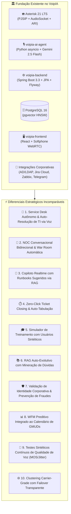

# 🚀 Plano Estratégico de Inovação & Diferenciais — VoipIA Enterprise

> **Documento:** Mapa Diretor de Inovações Estratégicas e Diferenciais de Mercado  
> **Sistema:** VoipIA Enterprise (`/opt/VoipIA`)  
> **Classificação:** Arquitetura de Soluções / Telefonia IP / IA Generativa / Service Desk & NOC  
> **Autor:** Engenharia Principal & Arquitetura de Soluções VoipIA  
> **Data de Atualização:** Agosto de 2026  

---

## 🎯 1. Contexto Real do Ecossistema VoipIA

O **VoipIA Enterprise** é uma plataforma corporativa unificada de missão crítica que atua na interseção de quatro grandes pilares:

1. **Telecomunicações & PBX IP de Alta Densidade:** Asterisk 21 LTS (PJSIP, WebSockets, AudioSocket TCP `:9092`, AMI/ARI, Coturn STUN/TURN, testes de conectividade de troncos/DDRs).
2. **Atendimento Omnicanal & Service Desk Inteligente:** URA conversacional com IA (**Google Gemini 2.5 Flash**), Desktop do Agente com Softphone WebRTC (`JsSIP`), Construtor Visual de Fluxos (*Flow Builder*), Chat Web e Telegram, Co-Browsing, sincronização com **Active Directory (AD/LDAPS)** e abertura automatizada de tickets no **Jira Cloud**.
3. **Speech Analytics & Qualidade (Insights):** Transcrição de áudio com diarização estéreo (Atendente vs. Solicitante), análise de sentimento, identificação de palavras de risco, preenchimento automatizado de Fichas de Monitoria (*Scorecards*), contestações e planos de coaching (PDI).
4. **Governança, AIOps & WFM:** Gestão de Alertas críticos **Zabbix** com chamadas automatizadas, Dimensionamento Preditivo de equipes com **WFM Erlang-C**, autenticação centralizada com **Microsoft Entra ID (SSO OIDC)**, controle de acesso granular RBAC por **Unidade de Negócio (BU)** e tarifação em tempo real de tokens de IA no Módulo Financeiro.

---

## 💡 2. Os 10 Grandes Diferenciais de Mercado do VoipIA

---

### 1. 🤖 Service Desk Autônomo & Auto-Resolução de TI via Voz
* **Oportunidade de Mercado:** As URAs corporativas tradicionais apenas transferem chamadas ou abrem chamados passivos. Demandas rotineiras de TI (reset de senha de rede, desbloqueio de conta, liberação de acesso VPN, status de ordens de serviço) ainda consomem tempo valioso dos analistas de N1.
* **O Diferencial VoipIA:**
  * A URA conversacional com **Google Gemini 2.5 Flash** autentica o colaborador via ramal/matrícula/AD e executa **ações de auto-resolução** por *Function Calling* seguro:
    1. **Desbloqueio / Reset de Senha no Active Directory:** A IA valida a identidade via token OTP enviado para o Telegram ou e-mail corporativo cadastrado no AD e executa o reset seguro via `LdapClient`.
    2. **Consulta e Atualização de Chamados Jira:** Informa o status em tempo real do chamado do usuário sem intervenção humana (*"Seu chamado SD-1082 sobre troca de monitor já foi aprovado pelo gestor e está com a equipe de Field Service"*).
    3. **Prevenção de Incidentes Duplicados:** Se houver um incidente massivo registrado no Zabbix/Jira (ex: instabilidade no link de internet ou ERP), a URA avisa o colaborador na saudação e pergunta se ele deseja ser inscrito para receber notificações de resolução via Telegram/SMS.
* **Componentes Utilizados:** `ai-agent`, `LdapClient`, `JiraClient`, `ZabbixService`, `SuporteController`.

---

### 2. 🚨 NOC Conversacional Bidirecional & War Room de Crise Automática
* **Oportunidade de Mercado:** Ferramentas de AIOps (PagerDuty, Opsgenie, Zabbix) disparam alertas por telefone que apenas reproduzem mensagens gravadas. O engenheiro precisa acordar, ligar o notebook, autenticar em VPN e abrir painéis para tomar uma ação.
* **O Diferencial VoipIA:**
  * O Módulo de Alertas Zabbix do VoipIA evolui de uma notificação passiva para um **NOC Interativo de Ação**:
    1. **Comandos de Voz Autorizados:** A IA liga para o engenheiro de plantão, resume o incidente técnico e pergunta: *"O cluster de banco de dados atingiu 95% de conexões bloqueadas. Deseja aplicar o script de limpeza de sessões órfãs, reiniciar o serviço secundário ou escalar para a coordenação?"*.
    2. **Execução Segura:** Mediante confirmação por voz ou código DTMF, o backend executa a ação de contingência via `docker-helper` ou API interna e registra na trilha de auditoria (`audit_logs`).
    3. **War Room / Ponte de Crise Automática:** Em incidentes de Severidade 5 (Disaster), o Asterisk cria instantaneamente uma conferência de áudio protegida (`ConfBridge`) e disca simultaneamente para todo o comitê de crise, conectando os plantonistas em menos de 30 segundos.
* **Componentes Utilizados:** `ZabbixAlertFlow`, `docker-helper`, `Asterisk AMI (Originate)`, `AuditLogService`.

---

### 3. 🧠 Copiloto Realtime com Runbooks Técnicos Sugeridos via pgvector
* **Oportunidade de Mercado:** O atendente de Service Desk perde minutos procurando runbooks e procedimentos de suporte na intranet enquanto o colaborador aguarda na linha.
* **O Diferencial VoipIA:**
  * Conexão do fluxo de áudio da chamada ao **motor de busca vetorial (`pgvector HNSW`)**:
    1. Durante a chamada no Softphone WebRTC, o copiloto de IA transcreve a fala do colaborador em tempo real.
    2. O backend consulta semanticamente a tabela `cc_kb_chunks` e exibe no **Desktop do Agente (`/callcenter`)** o passo a passo exato do runbook de resolução (ex: comandos de prompt para limpar cache DNS, configuração de proxy ou reinstalação de certificados).
    3. Exibe o histórico recente de chamados do colaborador no Jira e os equipamentos vinculados a ele no Active Directory.
* **Componentes Utilizados:** `CallCenterCopilotService`, `KnowledgeBaseVectorService`, `pgvector`, `Desktop WebSocket STOMP`.

---

### 4. ⏱️ Zero-Click Ticket Closing & Auto-Tabulação de Chamados
* **Oportunidade de Mercado:** Ao término de cada chamado, o analista gasta de 45 a 90 segundos digitando notas técnicas, selecionando categorias e atualizando o Jira (After-Call Work / ACW).
* **O Diferencial VoipIA:**
  * No instante em que a chamada é encerrada (Hangup):
    1. **Geração do Resumo Técnico:** O pipeline de IA estrutura a descrição em formato padrão ITIL: *Problema Reportado*, *Causa Raiz Diagnosticada*, *Ação de Correção Executada* e *Status Final*.
    2. **Classificação Automática:** Preenchimento da tabulação (`cc_dispositions`) e dos campos de categoria/componente do Jira.
    3. **Atualização / Fechamento do Ticket:** O chamado no Jira é atualizado ou encerrado via API v3 com a transcrição sumarizada e o tempo de atendimento real anexados.
  * O analista só precisa dar um clique de confirmação ou o sistema confirma sozinho em 3 segundos se a confiança for superior a 95%.
* **Componentes Utilizados:** `CallCenterDispositionService`, `JiraClient`, `InsightsService`, `cc_interactions`.

---

### 5. 🎓 Simulador de Treinamento de Analistas com "Usuários Sintéticos de TI"
* **Oportunidade de Mercado:** O treinamento de novos analistas de Service Desk N1 é demorado e exige supervisores dedicados realizando simulações manuais.
* **O Diferencial VoipIA:**
  * Criação de um ambiente de simulação utilizando o motor `voipia-ai-agent`:
    1. O analista em treinamento abre o Softphone WebRTC no modo "Simulador" e recebe chamadas simuladas de personas de colaboradores:
       * *Colaborador desesperado com apresentação em 5 minutos e problema no projetor/Teams;*
       * *Usuário com lentidão no sistema ERP e pouca familiaridade com TI;*
       * *Tentativa simulada de Engenharia Social / Phishing por telefone.*
    2. A IA avalia a postura, o questionamento técnico e a cordialidade do analista.
    3. Ao final, a **Ficha de Monitoria de Qualidade (Scorecard)** é preenchida automaticamente com a nota e sugestões de estudo adicionadas ao Plano de Coaching (PDI).
* **Componentes Utilizados:** `voipia-ai-agent`, `QualityScorecardService`, `AgentCoachingService`, `JsSIP Softphone`.

---

### 6. 📚 RAG Auto-Evolutivo com Mineração Contínua de Dúvidas e Falhas
* **Oportunidade de Mercado:** Bases de conhecimento de TI ficam desatualizadas rapidamente porque dependem de criação manual de artigos pelos supervisores.
* **O Diferencial VoipIA:**
  * O módulo de **Speech Analytics (Insights)** processa as centenas de gravações diárias e cruza com a base de conhecimento existente:
    1. **Identificação de Lacunas:** A IA detecta quando múltiplos colaboradores ligam com dúvidas recorrentes ou erros novos para os quais não há artigo correspondente no RAG (`cc_kb_articles`).
    2. **Geração de Rascunhos de Artigos:** O sistema gera automaticamente rascunhos de artigos em Markdown detalhando o sintoma, a causa e a solução validada pelos analistas que resolveram com sucesso.
    3. **Aprovação em 1 Clique:** O supervisor de Service Desk revisa as sugestões no menu de Base de Conhecimento e as publica com um clique, alimentando imediatamente o Copiloto e a URA com IA.
* **Componentes Utilizados:** `InsightsSpeechAnalyticsService`, `KnowledgeBaseAdminService`, `cc_kb_articles`, `pgvector`.

---

### 7. 🛡️ Validação de Identidade Corporativa & Prevenção de Engenharia Social
* **Oportunidade de Mercado:** Ataques cibernéticos modernos frequentemente exploram o Service Desk por telefone para resetar senhas de executivos e contas privilegiadas (*Voice Phishing / Vishing*).
* **O Diferencial VoipIA:**
  * Camada de segurança ativa contra fraude telefônica:
    1. **Verificação Multifatorial em Chamada:** Ao solicitar ações críticas (reset de senha de usuário VIP, liberação de acesso a banco de dados ou alteração de MFA), a URA/Copiloto dispara uma aprovação via notificação *Push/TOTP* no Microsoft Authenticator ou Telegram corporativo do titular cadastrado no Active Directory.
    2. **Validação de Ramal vs. Localização:** Cruzamento entre o IP do ramal SIP WebRTC, o departamento do colaborador e a Unidade de Negócio (BU) cadastrada.
    3. **Alerta de Risco de Vishing:** Detecção de padrões suspeitos de pressão psicológica ou termos de urgência atípicos na fala do solicitante.
* **Componentes Utilizados:** `AdUserService`, `MfaAuthService`, `AuditLogService`, `InsightsRiskWordsService`.

---

### 8. 📊 WFM Preditivo Integrado ao Calendário de GMUDs e Manutenções de TI
* **Oportunidade de Mercado:** O dimensionamento de equipes de suporte tradicional usa apenas médias históricas de chamadas, sendo surpreendido por picos causados por atualizações de sistemas e manutenções de TI programadas.
* **O Diferencial VoipIA:**
  * O motor de **WFM com Erlang-C** do VoipIA passa a cruzar o histórico com o calendário de mudanças corporativas:
    1. **Alerta Preventivo de Dimensionamento:** Se há um deploy de ERP ou migração de e-mail corporativo agendado para o fim de semana, a IA calcula o acréscimo estimado de tráfego na segunda-feira e projeta a escala ideal de analistas N1/N2 necessária para manter o SLA abaixo de 30 segundos.
    2. **Recomendação Dinâmica de Escala:** Sugere remanejamento de analistas entre filas de chat e voz nos momentos de pico do Service Desk.
* **Componentes Utilizados:** `WfmErlangCalculatorService`, `CcQueueScheduleRepository`, `CcAgentMetricsService`.

---

### 9. 📡 Testes Sintéticos Contínuos de Qualidade de Áudio & MOS Score
* **Oportunidade de Mercado:** Problemas de conectividade, jitter e perda de pacotes em troncos E1/SIP e links entre filiais só são descobertos quando os usuários reclamam de ligações picotadas ou mudas.
* **O Diferencial VoipIA:**
  * Evolução do módulo **Telecom → Testes de Conectividade**:
    1. **Discagem Sintética Agendada com Injeção de Áudio de Calibração:** O scheduler disca automaticamente entre ramais de teste e troncos de operadoras nos horários de menor movimento, reproduzindo um padrão de áudio e medindo o retorno.
    2. **Cálculo de MOS Score, Jitter e Latência:** Avaliação da qualidade percebida (MOS de 1.0 a 5.0) e latência de ponta a ponta.
    3. **Alerta Proativo de Degradação:** Notificação automática no Zabbix e Telegram antes que a operação seja afetada por oscilações na operadora de telecomunicações.
* **Componentes Utilizados:** `ConnectivityScheduler`, `StatsNumberTestRepository`, `Asterisk AMI/RTP`, `TelegramService`.

---

### 10. 🌐 Clustering Asterisk HA Ativo-Ativo com Kamailio & Failover Transparente
* **Oportunidade de Mercado:** Quedas de PBX em ambientes corporativos de grande porte (hospitais, logística, call centers 24/7) causam perda de chamadas ativas e prejuízos operacionais.
* **O Diferencial VoipIA:**
  * Arquitetura de Carrier-Grade Clustering detalhada em [`docs/PLANO_CLUSTERING_ASTERISK_HA.md`](docs/PLANO_CLUSTERING_ASTERISK_HA.md):
    1. **Balanceador SIP Kamailio / OpenSIPS:** Distribuição inteligente de sinalização SIP entre múltiplos nós Asterisk 21 LTS.
    2. **Sincronização de Sessões via DMQ:** Manutenção do estado dos softphones WebRTC em tempo real.
    3. **Zero-Downtime Maintenance:** Atualizações de containers e manutenção de servidores sem derrubar chamadas de colaboradores ou filas de atendimento.
* **Componentes Utilizados:** Kamailio, Asterisk 21 ARA (*Asterisk Realtime Architecture*), Keepalived VIP, PostgreSQL HA.

---

## 🎯 3. Matriz de Priorização Estratégica

| # | Iniciativa | Esforço Técnico | Impacto Operacional | Módulos Impactados |
|---|---|---|---|---|
| **1** | **Zero-Click Ticket Closing & Auto-Tabulação** | 🟢 Médio | 🚀 Imediato (Corta TMA e ACW) | Call Center & Jira |
| **2** | **Service Desk Autônomo com Auto-Resolução (AD/Jira)** | 🟡 Médio | 🔥 Alto Desafogamento do N1 | URA com IA, AD & Jira |
| **3** | **Copiloto Realtime com Runbooks via RAG (pgvector)** | 🟡 Médio | 📈 Aumento drástico de FCR | Desktop do Agente & RAG |
| **4** | **NOC Conversacional Interativo & War Room (Zabbix)** | 🟡 Médio | 💎 Diferencial Exclusivo AIOps | Alertas Zabbix & AMI |
| **5** | **RAG Auto-Evolutivo com Mineração de Dúvidas** | 🟢 Baixo-Médio | 📚 Base de Conhecimento Viva | Insights & Base RAG |
| **6** | **Simulador de Treinamento com Usuários Sintéticos** | 🟡 Médio | 🎓 Aceleração de Onboarding N1 | Qualidade & Softphone |
| **7** | **Validação de Identidade & Prevenção de Vishing** | 🟢 Médio | 🛡️ Segurança Cibernética / AD | URA & Governança |
| **8** | **Testes Sintéticos de Qualidade de Áudio (MOS Score)** | 🟢 Baixo-Médio | 📡 Confiabilidade Telecom | Conectividade & Zabbix |
| **9** | **WFM Preditivo Integrado a GMUDs de TI** | 🟢 Médio | ⏱️ Otimização de Escalas N1/N2 | WFM Erlang-C |
| **10** | **Clustering Asterisk HA Ativo-Ativo** | 🔴 Alto | 🌐 Alta Disponibilidade 99.999% | Infraestrutura PBX |

---

## 🏆 4. Conclusão & Próximos Passos

O **VoipIA Enterprise** tem em suas mãos os alicerces tecnológicos mais avançados do mercado (Asterisk 21 LTS, Spring Boot 3.3, Google Gemini 2.5 Flash, pgvector, WebSockets STOMP, Active Directory e Jira Cloud).

Ao focar a inteligência artificial na **resolução real de problemas corporativos e de TI**, na **assistência ativa ao analista em tempo real** e na **automação de infraestrutura e NOC**, o VoipIA se consolida como uma solução incomparável para qualquer empresa de médio ou grande porte.
