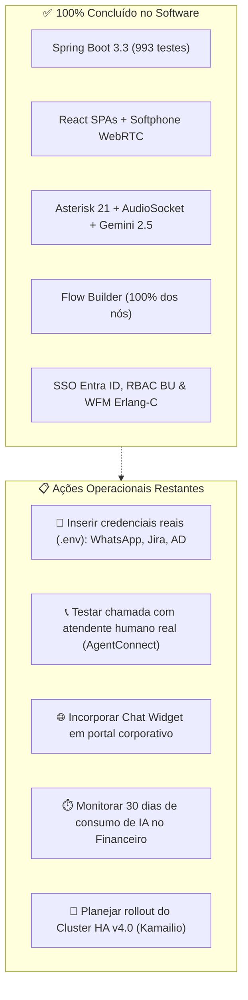

# 📋 Mapeamento de Pendências & Próximos Passos — VoipIA Enterprise

> **Sistema:** VoipIA Enterprise (`/opt/VoipIA`)  
> **Versão Oficial:** v3.5 Enterprise  
> **Status do Software:** ✅ 100% Concluído, Saneado e Testado (993 testes aprovados)  
> **Status de Execução:** ✅ 10 Containers Docker Operacionais e Saudáveis (*Healthy*)  
> **Data de Atualização:** 21 de Agosto de 2026  

---

## 🎯 1. Visão Geral do Estado Atual

O **VoipIA Enterprise** encontra-se com sua base de código **100% concluída, integrada e operacional**. Todas as funcionalidades de software planejadas nas Fases 1 a 27 do plano-mãe foram implementadas, validadas e auditadas sob padrões rigorosos de segurança e arquitetura:

* **Backend Spring Boot 3.3 (Java 21):** 993 testes automatizados aprovados (0 falhas) e migrações Flyway V1 a V96 aplicadas.
* **Frontend React (TypeScript Strict):** Build otimizado, sem erros de tipagem (`tsc --noEmit` limpo) e integração total com softphone WebRTC (`JsSIP`).
* **Asterisk 21 LTS & AudioSocket:** Streaming de áudio PCM bidirecional com barge-in via WebRTC VAD e Google Gemini 2.5 Flash.
* **Containers Docker:** 10 containers saudáveis (`voipia-caddy`, `voipia-backend`, `voipia-frontend`, `voipia-asterisk`, `voipia-ai-agent`, `voipia-insights`, `voipia-docker-helper`, `voipia-coturn`, `voipia-postgres`, `voipia-security`).

As pendências remanescentes **não são de desenvolvimento de software**, mas sim **dependências externas de credenciais, validações em ambiente operacional real e marcos de escala futura**.

---

## 🔍 2. Detalhamento das Pendências por Categoria

---

### 🔑 Categoria 1: Dependências Externas & Credenciais de Produção
São integrações cujo código-fonte está 100% desenvolvido e coberto por testes, aguardando apenas o fornecimento de credenciais corporativas no arquivo `env/.env`:

| Integração | Componente no Código | Variáveis de Ambiente Necessárias | Descrição / Estado |
|---|---|---|---|
| **WhatsApp Cloud API** | `CcChatChannel` / Webhook | `WHATSAPP_TOKEN`, `WHATSAPP_PHONE_NUMBER_ID`, `WHATSAPP_VERIFY_TOKEN` | O canal de chat omnicanal está modelado e pronto para ingestão de mensagens e disparo ativo. Depende do cadastro da conta empresarial no Meta Business Manager / provedor BSP. |
| **Jira Cloud REST API v3** | `JiraClient.java`, `SuporteController.java` | `JIRA_BASE_URL`, `JIRA_USER_EMAIL`, `JIRA_API_TOKEN`, `JIRA_PROJECT_KEY` | Código de abertura de chamados via URA e fechamento automático de tickets 100% implementado. Requer o preenchimento das credenciais da instância corporativa do Atlassian Jira Cloud. |
| **Active Directory / LDAPS** | `LdapClient.java`, `AdUserService.java`, `AdSyncTab.tsx` | `LDAP_URL`, `LDAP_BASE_DN`, `LDAP_SECURITY_PRINCIPAL`, `LDAP_SECURITY_CREDENTIALS` | Sincronização de usuários com paginação real (`PagedResultsDirContextProcessor`), mapeamento de grupos e tela em *Configurações → Active Directory*. Requer conectividade de rede com o Domain Controller corporativo (porta TCP 636 LDAPS). |

---

### 📞 Categoria 2: Validações Operacionais com Usuários Reais
O caminho funcional foi validado com chamadas geradas via CLI Asterisk (`channel originate`), corrigindo os 4 bugs críticos de dialplan e AMI identificados durante os testes. Restam validações com operadores humanos:

1. **Atendimento com Agente Humano Real (`AgentConnect`):**
   * **Situação Atual:** As chamadas de teste atravessaram com sucesso o dialplan `_5XXX`, geraram eventos `QueueCallerJoin`/`QueueCallerAbandon` capturados pelo `CallCenterAmiEventListener` e registraram as interações em `cc_interactions`.
   * **Pendente:** Conectar um operador real com softphone WebRTC logado em um ramal da fila (`cc_agents`) para validar o fluxo de ponta a ponta com o evento de conexão de agente humano (`AgentConnect`).
2. **Validação Visual do Chat Widget Incorporado:**
   * **Situação Atual:** A API pública do chat (`/api/v1/chat/public/**`) foi 100% validada via chamadas HTTP (criação de sessão, envio de mensagens e encerramento).
   * **Pendente:** Testar o script incorporável [`frontend/public-widget/callcenter-chat-widget.js`](frontend/public-widget/callcenter-chat-widget.js) renderizado visualmente em um navegador dentro de uma intranet corporativa real.

---

### 📊 Categoria 3: Medição de Custos & Dimensionamento de Infraestrutura

1. **Medição de 30 Dias de Tráfego de IA em Produção (Fase 18):**
   * **Situação Atual:** O estudo de viabilidade arquitetural sobre IA Local (Whisper local / Ollama / GPU dedicada) vs. Google Gemini 2.5 Flash via API foi concluído.
   * **Pendente:** A decisão técnica e financeira final depende da coleta de 30 dias de métricas de tráfego real com volume corporativo, monitoradas através do [Módulo Financeiro](docs/MANUAL_DO_USUARIO.md).
2. **Dimensionamento de Hardware para Alta Concorrência (250 Agentes):**
   * **Situação Atual:** O ambiente atual opera em uma VPS de desenvolvimento com 2 vCPUs e 4GB de memória RAM.
   * **Pendente:** Para sustentar a meta corporativa de 250 agentes simultâneos com gravação contínua e transcodificação de áudio, provisionar a infraestrutura homologada no [Guia de Implantação](docs/IMPLANTACAO.md) (mínimo 8 vCPUs / 16-32GB RAM e armazenamento NVMe).

---

### 🚀 Categoria 4: Próximos Marcos Arquiteturais (v4.0)

* **Clustering Asterisk HA Ativo-Ativo com Kamailio:**
  * **Situação Atual:** O plano arquitetural detalhado e a topologia estão totalmente estruturados no documento [`docs/PLANO_CLUSTERING_ASTERISK_HA.md`](docs/PLANO_CLUSTERING_ASTERISK_HA.md).
  * **Pendente:** Execução na janela de escalabilidade horizontal corporativa (balanceador SIP Kamailio/OpenSIPS, sincronização de sessões em memória via DMQ e VIP flutuante Keepalived).

---

## 📋 3. Resumo da Matriz de Ação

---

## 🎯 4. Conclusão

O **VoipIA Enterprise** está pronto para homologação e operação corporativa. O avanço das pendências listadas depende unicamente do provisionamento das credenciais dos serviços integrados (WhatsApp, Jira, AD) e do agendamento dos testes com operadores reais.
