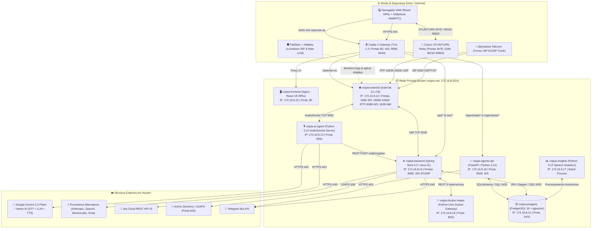
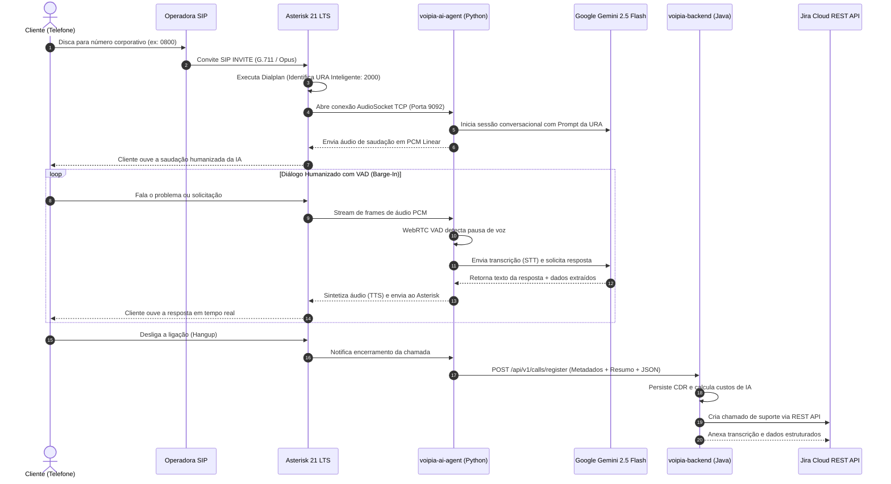
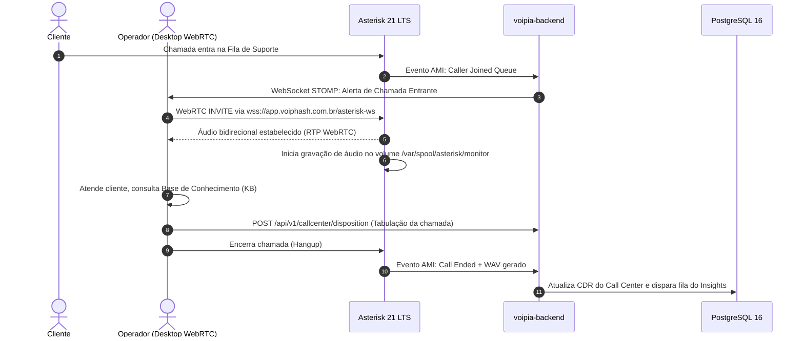
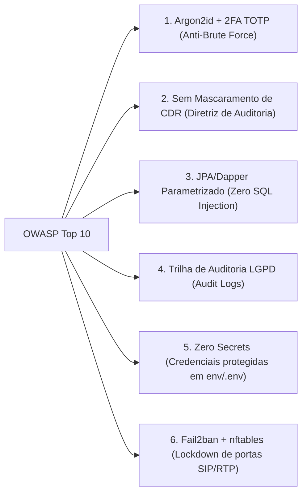

# 🏛️ Arquitetura de Software & Infraestrutura — VoipIA Enterprise

> **Sistema:** VoipIA — Plataforma Corporativa de Telefonia IP, URA Conversacional com IA, Call Center Omnicanal & Speech Analytics  
> **Versão Oficial:** v3.2 Enterprise (Asterisk 21 LTS + Spring Boot 3.3 + FastAPI + React 18 + Google Gemini)  
> **Classificação de Segurança:** OWASP ASVS Nível 2 / Zero Trust / Zero Secrets  
> **Data de Atualização:** Agosto de 2026  

---

## 1. Visão Executiva da Arquitetura

O **VoipIA** é o ecossistema corporativo de missão crítica projetado para unificar telefonia IP de alta densidade, inteligência artificial generativa conversacional em tempo real, plataforma de atendimento de Call Center omnicanal, auditoria e transcrição de gravações (*Speech Analytics / Insights*) e agentes de automação autônomos.

O sistema opera em containers Docker desacoplados sob uma rede bridge isolada (`voipia-net: 172.16.8.0/24`), com proxy reverso de terminação TLS automática (Caddy 2), persistência relacional e vetorial no **PostgreSQL 16 com extensão pgvector**, e gateway de mídia WebRTC com **Coturn (STUN/TURN)**.

---

## 2. Componentes & Camadas do Sistema

A arquitetura do **VoipIA** é dividida em subsistemas especializados e desacoplados:

### 2.1. PBX & Motor de Voz (Asterisk 21 LTS)
* **chan_pjsip:** Módulo moderno de SIP para terminação de troncos de operadoras E1/SIP e ramais IP.
* **res_pjsip_transport_websocket:** Suporte nativo a WebSockets (`wss://`) para conexão de softphones WebRTC no navegador.
* **res_rtp_asterisk:** Faixa de portas de mídia RTP estritamente parametrizada entre `16000` e `16500/udp`.
* **app_audiosocket:** Extensão de streaming bidirecional de áudio em tempo real para o container `ai-agent` através de conexão TCP (`:9092`) de ultrabaixa latência.
* **AMI (Asterisk Manager Interface):** Conexão TCP na porta `5038` consumida pelo backend Spring Boot para discagem automática, escuta de chamadas (*Spy*), sussurro (*Whisper*) e captura de eventos de fila.

### 2.2. Agente Conversacional de IA (voipia-ai-agent)
* Desenvolvido em **Python 3.12 asyncio**.
* Atua como servidor de áudio AudioSocket TCP (porta `9092`), recebendo frames PCM Linear 8kHz/16kHz 16-bit.
* Integra o **WebRTC VAD (Voice Activity Detection)** para interrupção de fala (*barge-in* natural).
* Conecta-se à API do **Google Gemini 2.5 Flash** (e provedores secundários via *Function Calling*), realizando transcrição de fala (STT), raciocínio contextual e síntese de voz (TTS) humanizada em milissegundos.

### 2.3. Backend Principal (voipia-backend — Spring Boot 3.3)
* Desenvolvido em **Java 21 LTS** seguindo princípios de **Clean Architecture e DDD**.
* Gerenciamento de persistência com **Spring Data JPA/Hibernate** e migrações automatizadas via **Flyway (V1 a V14)**.
* Notificações em tempo real com **WebSocket STOMP** para atualização dinâmica do Dashboard, status de operadores e Wallboards de fila.
* Integração nativa com Jira Cloud (criação automática de chamados a partir da URA de voz) e sincronização corporativa com Active Directory / LDAPS.

### 2.4. Plataforma de Agentes de Automação (voipia-agents-api & frontend)
* Backend em **FastAPI (Python 3.12)** com arquitetura assíncrona.
* Executores modulares de tarefas: agentes SSH, crawlers Web, consultores de Banco de Dados e analisadores de Logs.
* Agendador integrado (*Scheduler*) com persistência de execuções, histórico e cofre de segredos criptografado.

### 2.5. Frontend SPA & Softphone WebRTC (voipia-frontend)
* Desenvolvido em **React 18 + TypeScript (Strict) + Vite**.
* Estilização moderna com **Tailwind CSS**, componentes acessíveis e gráficos interativos com **Recharts**.
* Softphone WebRTC integrado via **JsSIP**, permitindo chamadas telefônicas diretamente na interface do navegador com suporte a DTMF, Hold, Transferência e Mute.

### 2.6. Speech Analytics & Insights (voipia-insights)
* Motor assíncrono em Python para transcrição diarizada de chamadas gravadas.
* Análise de sentimento, identificação de palavras de risco (jurídico, PROCON, cancelamento), cálculo de NPS e preenchimento autônomo de fichas de monitoria de qualidade (Scorecards).

### 2.7. Banco de Dados Unificado (PostgreSQL 16 + pgvector)
* Banco de dados relacional unificado para toda a plataforma.
* Extensão **pgvector** habilitada para busca semântica por similaridade de vetores (*Embeddings* de base de conhecimento e transcrições de chamadas).

---

## 3. Fluxos Principais de Dados

### 3.1. Atendimento da URA Conversacional com IA (Tempo Real)

### 3.2. Atendimento Humano no Call Center com Softphone WebRTC

---

## 4. Regras Críticas de Negócio & Governança

### 4.1. Diretriz de Não-Mascaramento de CDR (CDR Privacy Compliance)
* Por exigência mandatória de governança corporativa, auditoria jurídica e controle de tráfego de telecomunicações, **os números de telefone completos (ANI e B-Number) NUNCA são mascarados** em relatórios, tabelas ou APIs para usuários autenticados e autorizados.

### 4.2. Isolamento Multitenant por Unidade de Negócio (BU Scoping)
* Cada usuário, fila, operador e registro de URA é associado a uma ou mais **Unidades de Negócio (BU)** cadastradas em `user_business_units`.
* As consultas ao histórico de chamadas, transcrições e cadastros filtram estritamente pelo escopo da BU do usuário logado.
* Usuários com perfil `ADMIN` possuem visão global de todas as BUs.

### 4.3. Matriz RBAC Granular (Mais de 40 Recursos)
* Controle de acesso baseado em permissões granulares por chave de recurso (`resource_key`), permitindo operações de Leitura (`r`) ou Leitura e Escrita (`rw`) em módulos de Telecom, Call Center, Insights, Financeiro e Administração.

---

## 5. Segurança, Threat Modeling & DevSecOps (OWASP ASVS Nível 2)

### 5.1. Diretrizes de Segurança Invioláveis:
1. **Autenticação Segura:** Senhas locais protegidas com algoritmo **Argon2id** de alta entropia e suporte a **Segundo Fator de Autenticação (2FA / TOTP)** via QR Code.
2. **Tokens de Sessão:** Tokens **JWT (JSON Web Tokens)** assinados com chaves simétricas HMAC-SHA256 de 512 bits e expiração controlada.
3. **Proteção Anti-Força Bruta & Lockdown SIP:**
   * **Camada Web:** `RateLimitFilter` bloqueia requisições excessivas por IP.
   * **Camada SIP:** `Fail2ban` monitora logs de autenticação do Asterisk e bloqueia IPs maliciosos diretamente no `nftables` do kernel Linux.
4. **Zero Secrets em Código:** Nenhuma credencial de banco, API Key ou segredo de integração é versionada no Git. Todas residem no arquivo `/opt/VoipIA/env/.env` com permissões `chmod 600`.
5. **Trilha de Auditoria LGPD:** Todas as consultas, alterações de cadastros, escutas de chamadas e exportações são registradas com carimbo UTC, ID do usuário, IP de origem e detalhes da operação na tabela `audit_logs`.

---

## 6. Benchmark Comparativo de Mercado

| Dimensão / Funcionalidade | Genesys Cloud CX | Twilio Flex | Asterisk Puro (Open Source) | **VoipIA (v3.2 Enterprise)** |
|---|---|---|---|---|
| **Arquitetura de Deploy** | Cloud SaaS Exclusivo | Cloud PaaS | On-Premise Manual | **Docker Container On-Premise / Cloud Híbrida (HA)** |
| **URA Conversacional de IA** | Cobrança extra por minuto | Requer desenvolvimento | Ausente (apenas DTMF) | **Nativa via AudioSocket + Google Gemini 2.5 Flash** |
| **Softphone WebRTC** | Sim (WebRTC) | Sim (WebRTC) | Requer configuração complexa | **Nativo com JsSIP + Coturn STUN/TURN integrado** |
| **Speech Analytics & Insights** | Módulo caro adicional | Integração de terceiros | Ausente | **Nativo (Diarização, Sentimento, Scorecards e NPS)** |
| **Plataforma de Agentes Autônomos** | Não possui | Não possui | Não possui | **Nativa (FastAPI + Agentes SSH, Web, DB e Logs)** |
| **Custo Total de Propriedade (TCO)** | Altíssimo (por assento/mês) | Alto (pago por minuto/evento) | Baixo (alto custo de sustentação) | **Baixíssimo (Uso de hardware próprio + IA sob demanda)** |
| **Privacidade & Controle de Dados** | Nuvem de Terceiros | Nuvem de Terceiros | Controle Total | **Controle Total (Zero Trust / On-Premise)** |

---

## 7. Resiliência, Alta Disponibilidade & Degradação Graciosa

1. **Degradação Graciosa da IA:** Caso a API do Google Gemini sofra instabilidade ou latência excessiva, a URA executa uma mensagem pré-gravada de contingência e transfere a ligação imediatamente para a fila humana do Call Center sem derrubar a chamada.
2. **Sondas de Saúde (Healthchecks):** Todos os containers Docker contam com verificações ativas de integridade (`pg_isready`, sondas HTTP `/health`, verificação de porta TCP).
3. **Isolamento de Falhas:** O travamento eventual do módulo de relatórios ou de agentes de automação não afeta a recepção de chamadas do Asterisk nem a API de telefonia.
