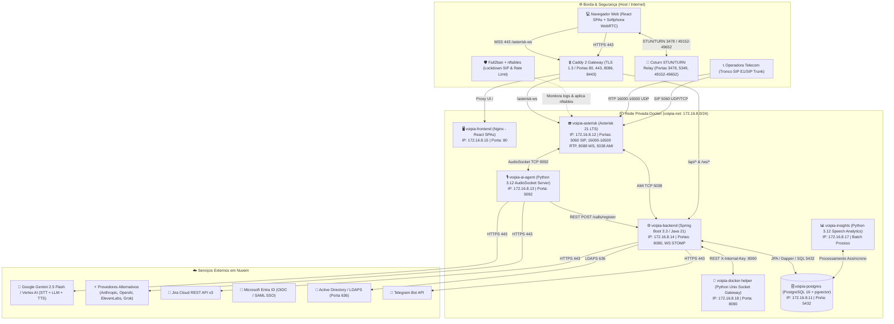
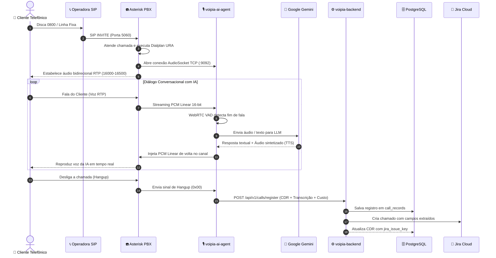

# 🏛️ Arquitetura de Software & Infraestrutura — VoipIA Enterprise

> **Sistema:** VoipIA — Plataforma Corporativa de Telefonia IP, URA Conversacional com IA, Call Center Omnicanal & Speech Analytics  
> **Versão Oficial:** v3.5 Enterprise (Asterisk 21 LTS + Spring Boot 3.3 + Python 3.12 + React + PostgreSQL 16 pgvector)  
> **Classificação de Segurança:** OWASP ASVS Nível 2 / Zero Trust / Zero Secrets  
> **Data de Atualização:** 20 de Agosto de 2026  

---

## 1. Visão Executiva da Arquitetura

O **VoipIA** é o ecossistema corporativo de missão crítica projetado para unificar telefonia IP de alta densidade, inteligência artificial generativa conversacional em tempo real, plataforma de atendimento de Call Center omnicanal, dimensionamento preditivo WFM (Erlang-C), copiloto realtime, auditoria e transcrição de gravações com busca vetorial (*Speech Analytics / Insights*) e governança centralizada com SSO Microsoft Entra ID.

O sistema opera em 10 containers Docker desacoplados sob uma rede bridge privada e isolada (`voipia-net: 172.16.8.0/24`), com proxy reverso de terminação TLS automática (Caddy 2), persistência relacional e vetorial no **PostgreSQL 16 com extensão pgvector (HNSW)**, e gateway de mídia WebRTC com **Coturn (STUN/TURN)**.

---

## 2. Componentes & Camadas do Sistema

A arquitetura do **VoipIA** é dividida em subsistemas especializados e desacoplados:

### 2.1. PBX & Motor de Voz (voipia-asterisk — Asterisk 21 LTS)
* **chan_pjsip:** Módulo moderno de SIP para terminação de troncos de operadoras E1/SIP e ramais IP.
* **res_pjsip_transport_websocket:** Suporte nativo a WebSockets (`wss://`) para conexão de softphones WebRTC no navegador.
* **res_rtp_asterisk:** Faixa de portas de mídia RTP estritamente parametrizada entre `16000` e `16500/udp`.
* **app_audiosocket:** Extensão de streaming bidirecional de áudio em tempo real para o container `ai-agent` através de conexão TCP (`:9092`) de ultrabaixa latência.
* **AMI (Asterisk Manager Interface):** Conexão TCP na porta `5038` consumida pelo backend Spring Boot para discagem automática, escuta de chamadas (*Spy*), sussurro (*Whisper*) e captura de eventos de fila.

### 2.2. Agente Conversacional de IA (voipia-ai-agent)
* Desenvolvido em **Python 3.12 asyncio**.
* Atua como servidor de áudio AudioSocket TCP (porta `9092`), recebendo frames PCM Linear 8kHz/16kHz 16-bit.
* Integra o **WebRTC VAD (Voice Activity Detection)** para interrupção de fala (*barge-in* natural).
* Conecta-se à API do **Google Gemini 2.5 Flash** (e provedores secundários via *Function Calling*), realizando transcrição de fala (STT), raciocínio contextual e síntese de voz (TTS) humanizada em milissegundos.

### 2.3. Backend Principal (voipia-backend — Spring Boot 3.3)
* Desenvolvido em **Java 21 LTS** seguindo princípios de **Clean Architecture e DDD**.
* Gerenciamento de persistência com **Spring Data JPA/Hibernate** e migrações automatizadas via **Flyway (V1 a V96)**.
* Notificações em tempo real com **WebSocket STOMP** para atualização dinâmica do Dashboard, status de operadores e Wallboards de fila.
* Integração nativa com Jira Cloud (criação automática de chamados a partir da URA de voz) e sincronização corporativa com Active Directory / LDAPS.
* Módulos de negócio: Telecom, Call Center Omnichannel (filas, skills, gravações, chat, co-browsing, RAG), Insights e Gestão Financeira.

### 2.4. Speech Analytics & Processamento de Áudio (voipia-insights)
* Desenvolvido em **Python 3.12** com processamento assíncrono.
* Transcrição automatizada com diarização de falantes (Atendente vs. Cliente).
* Análise de sentimento, identificação de palavras de risco e conformidade regulatória.
* Preenchimento automatizado de Fichas de Monitoria de Qualidade (*Scorecards*) com cálculo de notas e justificativas fundamentadas por IA.

### 2.5. Frontend SPA & WebRTC (voipia-frontend)
* Nginx 1.27 servindo SPAs React com TypeScript (`strict`) e Vite.
* **Telecom Web SPA:** Gestão de URA, ramais, troncos, CDRs, financeiro e governança.
* **Call Center Web SPA:** Desktop do Agente com Softphone WebRTC (`JsSIP`), Painel de Supervisão em Tempo Real (*Spy / Whisper*), Construtor de Fluxos (*Flow Builder*) e Atendimento Chat.
* **Insights Web SPA:** Central de Chamadas Auditadas, Player de Áudio com transcrição interativa, Fichas de Monitoria, Contestações e Planos de Coaching.
* **Chat Public Widget:** Widget JavaScript leve para incorporação de chat de atendimento em portais corporativos externos.

### 2.6. Isolamento e Segurança (voipia-docker-helper, voipia-security, voipia-caddy)
* **voipia-docker-helper:** Serviço interno restrito (porta `8090`, autenticado via `X-Internal-Key`) que executa leitura de logs e telemetria, garantindo que o backend não necessite de acesso direto ao socket Docker do host (*Menor Privilégio*).
* **voipia-security:** Monitor de segurança com Fail2ban e regras de firewall dinâmico (*nftables*) para prevenção contra força bruta SIP e ataques de negação de serviço.
* **voipia-caddy:** Gateway de entrada com terminação TLS 1.3 automática, cabeçalhos de segurança OWASP (HSTS, CSP, X-Frame-Options) e proxy reverso inteligente.

---

## 3. Topologia de Rede & Especificação de Portas

A rede bridge `voipia-net` (`172.16.8.0/24`) isola a comunicação entre containers. Apenas os serviços de borda expõem portas para o host:

| Container | IP Interno | Porta Interna | Porta Exposta (Host) | Protocolo | Finalidade |
|---|---|---|---|---|---|
| `voipia-caddy` | 172.16.8.2 | 80, 443 | 80, 443 | TCP/UDP | Gateway HTTP/HTTPS/HTTP3 e Terminação TLS |
| `voipia-postgres` | 172.16.8.11 | 5432 | 127.0.0.1:5434 | TCP | Banco de Dados PostgreSQL 16 + pgvector |
| `voipia-asterisk` | 172.16.8.12 | 5060 | 0.0.0.0:5061 $\to$ 5060 | UDP/TCP | Sinalização SIP Telefonia IP |
| `voipia-asterisk` | 172.16.8.12 | 16000-16500 | 16000-16500 | UDP | Mídia RTP de Voz em Tempo Real |
| `voipia-asterisk` | 172.16.8.12 | 8088 | Interna (Proxy Caddy) | TCP | WebSockets SIP WebRTC (`/asterisk-ws`) |
| `voipia-asterisk` | 172.16.8.12 | 5038 | Interna | TCP | Asterisk Manager Interface (AMI) |
| `voipia-ai-agent` | 172.16.8.13 | 9092 | Interna | TCP | Servidor AudioSocket PCM Linear |
| `voipia-backend` | 172.16.8.14 | 8080 | Interna (Proxy Caddy) | TCP | REST API e WebSocket STOMP |
| `voipia-frontend` | 172.16.8.15 | 80 | Interna (Proxy Caddy) | TCP | Nginx de Arquivos Estáticos SPAs |
| `voipia-insights` | 172.16.8.17 | Batch | Interna | — | Worker Speech Analytics |
| `voipia-docker-helper` | 172.16.8.18 | 8090 | Interna | TCP | API Interna de Logs e Telemetria |
| `voipia-coturn` | Host Network | 3478, 5349, 49152-49652 | 3478, 5349, 49152-49652 | UDP/TCP | Servidor STUN/TURN WebRTC |

---

## 4. Fluxo de Dados & Comunicação de Chamadas

---

## 5. Diretrizes de Segurança (DevSecOps)

1. **Zero Secrets em Código:** Chaves de API, senhas de banco e segredos JWT são lidos estritamente de variáveis de ambiente (`env/.env` com permissão `chmod 600`).
2. **Criptografia de Senhas:** Todas as senhas de usuários são cifradas com **Argon2id** (ou BCrypt com salt de alta complexidade).
3. **Autenticação em Dois Fatores (2FA):** Suporte nativo a **TOTP (RFC 6238)** com Google Authenticator e Microsoft Authenticator.
4. **Isolamento de Banco:** PostgreSQL configurado com bind estrito em `127.0.0.1` e portas de container não expostas publicamente.
5. **Rate Limiting & Anti-Brute Force:** Proteção em nível de aplicação com `RateLimitFilter` e em nível de borda com `Fail2ban + nftables`.
6. **Políticas de CSP e Headers HTTP:** Strict-Transport-Security, X-Content-Type-Options: nosniff, X-Frame-Options: SAMEORIGIN e Referrer-Policy: strict-origin-when-cross-origin.
