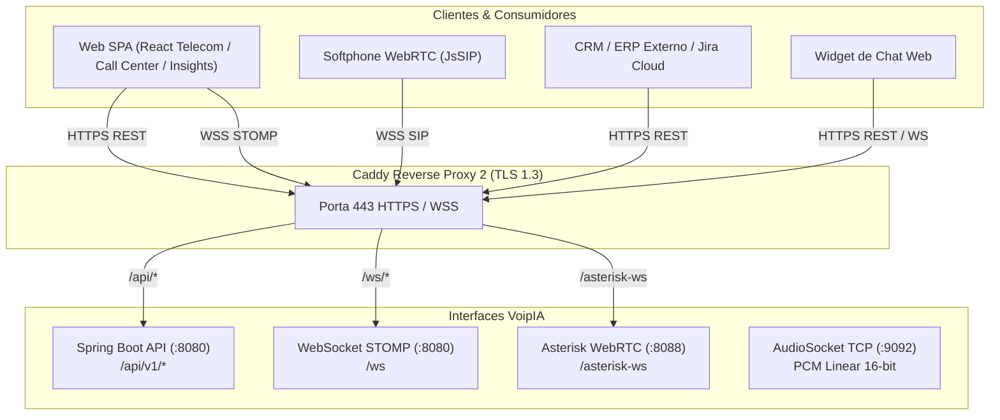

# 📡 Documentação das APIs & WebSockets — VoipIA Enterprise

> **Sistema:** VoipIA — Plataforma Corporativa de Telefonia IP, URA Conversacional com IA, Call Center Omnicanal & Speech Analytics  
> **Versão da API:** v1 / v3.2 Enterprise  
> **Autenticação:** Bearer Token JWT (HMAC-SHA256) / Cookie httpOnly / X-Internal-Key  
> **Padrão:** RESTful JSON, WebSocket STOMP, AudioSocket TCP e Asterisk AMI/WSS  
> **Data de Atualização:** 20 de Agosto de 2026  

---

## 1. Visão Geral das Interfaces & Protocolos

O **VoipIA** disponibiliza um conjunto completo e unificado de interfaces de integração para sistemas corporativos, CRMs, plataformas de BI, canais digitais e clientes WebRTC:



---

## 2. Autenticação e Padrões de Segurança

### 2.1. Cabeçalho de Autenticação JWT (Bearer Token)
Todas as requisições autenticadas devem incluir o header HTTP `Authorization`:
```http
Authorization: Bearer <seu_token_jwt>
```

### 2.2. Respostas de Erro Padronizadas
As respostas de erro seguem o padrão RFC 7807 (Problem Details):
```json
{
  "timestamp": "2026-08-19T15:30:00Z",
  "status": 401,
  "error": "Unauthorized",
  "message": "Token JWT inválido ou expirado.",
  "path": "/api/v1/calls/history"
}
```

---

## 3. Catálogo Completo de Endpoints REST

### 3.1. Autenticação & Sessão (`/api/v1/auth`)

#### `POST /api/v1/auth/login`
Autentica o usuário com login e senha (validação com Argon2id/BCrypt ou bind Active Directory/LDAP) e retorna o token JWT e permissões RBAC. Em caso de 2FA ativado, retorna `requiresTotp: true` e `tempToken`.

* **Requisição:**
```bash
curl -X POST https://app.voiphash.com.br/api/v1/auth/login \
  -H "Content-Type: application/json" \
  -d '{
    "username": "operador.telecom",
    "password": "SenhaForte@2026"
  }'
```

* **Resposta de Sucesso (200 OK):**
```json
{
  "token": "eyJhbGciOiJIUzUxMiIsInR5cCI6IkpXVCJ9...",
  "type": "Bearer",
  "extension": 9001,
  "name": "Carlos Silva",
  "role": "ADMIN",
  "requiresTotp": false
}
```

#### `POST /api/v1/auth/totp/verify`
Valida o código de 6 dígitos gerado pelo aplicativo autenticador (Google Authenticator) utilizando o token temporário.

#### `GET /api/v1/auth/sso/config`
Retorna se o SSO está ativo e o nome de exibição do provedor para renderização na tela de login.

#### `GET /api/v1/auth/sso/authorize-url`
Gera a URL de autorização OpenID Connect (OIDC) com State e Nonce criptográficos para redirecionar o usuário para o Microsoft Entra ID.

#### `POST /api/v1/auth/sso/callback`
Processa o código de autorização (`code`) devolvido pela Microsoft, valida o ID Token com chave pública do Tenant, extrai email/nome, efetua auto-provisionamento de usuário/ramal SIP e emite o token JWT corporativo.

#### `PUT /api/v1/auth/sso/admin/config`
Permite aos administradores com permissão `PERM_WRITE_admin.sso` configurar Client ID, Client Secret, Tenant ID, Redirect URI e switch de auto-provisionamento.

---

### 3.2. URA & Telefonia (`/api/v1/ura` & `/api/v1/calls`)

#### `GET /api/v1/ura/instances`
Lista todas as instâncias de URA ativas no sistema.

* **Requisição:**
```bash
curl -X GET https://app.voiphash.com.br/api/v1/ura/instances \
  -H "Authorization: Bearer <token>"
```

* **Resposta de Sucesso (200 OK):**
```json
[
  {
    "id": 1,
    "extension": "2000",
    "name": "URA Service Desk TI",
    "aiProvider": "GEMINI",
    "model": "gemini-2.5-flash",
    "welcomeMessage": "Olá! Bem-vindo ao suporte de TI da empresa. Como posso te ajudar hoje?",
    "jiraProjectKey": "TI",
    "jiraIssueType": "Incident",
    "isActive": true
  }
]
```

#### `POST /api/v1/calls/register`
Endpoint interno chamado pelo `voipia-ai-agent` ao término da chamada para registrar o CDR, tarifação e criar ticket no Jira.

* **Requisição:**
```bash
curl -X POST http://voipia-backend:8080/api/v1/calls/register \
  -H "Content-Type: application/json" \
  -H "X-Internal-Key: <internal_key>" \
  -d '{
    "callId": "ast-1724083200.104",
    "callerNumber": "11987654321",
    "extension": "2000",
    "durationSeconds": 142,
    "transcription": "Cliente relatou lentidão no VPN corporativo...",
    "extractedFields": {
      "solicitante": "Carlos Silva",
      "email": "carlos@empresa.com.br",
      "sistema": "VPN",
      "urgencia": "Alta"
    },
    "jiraIssueKey": "TI-4509",
    "aiCostUsd": 0.0034
  }'
```

#### `GET /api/v1/calls/history`
Consulta histórico de chamadas com paginação e filtros por data, número e status.

---

### 3.3. Call Center Omnicanal (`/api/v1/callcenter`)

#### `GET /api/v1/callcenter/queues`
Retorna a lista de filas de atendimento, membros associados e métricas em tempo real.

#### `GET /api/v1/callcenter/agents`
Lista atendentes humanos e agentes virtuais de IA, incluindo estado atual de presença e skills.

#### `POST /api/v1/callcenter/spy`
Inicia a escuta silenciosa (*Chanspy*) ou sussurro (*Whisper*) de uma chamada em andamento para supervisores.

* **Requisição:**
```bash
curl -X POST https://app.voiphash.com.br/api/v1/callcenter/spy \
  -H "Authorization: Bearer <token>" \
  -H "Content-Type: application/json" \
  -d '{
    "supervisorExtension": "9002",
    "targetChannel": "PJSIP/4001-000000a4",
    "whisper": false
  }'
```

#### `GET /api/v1/callcenter/flows` & `POST /api/v1/callcenter/flows`
Endpoints do Construtor de Fluxos (*Flow Builder*) para criação, edição e publicação de grafos de atendimento visual.

#### `GET /api/v1/callcenter/recordings`
Consulta e reprodução de gravações telefônicas com suporte a controle de retenção e expurgo automático.

#### `GET /api/v1/callcenter/chat/sessions` & `POST /api/v1/callcenter/chat/send`
Gerenciamento de sessões de chat omnicanal (Telegram e Web Widget), envio de mensagens e anexos.

#### `POST /api/v1/callcenter/cobrowsing/sessions`
Iniciação de sessão de navegação assistida e compartilhamento de tela com consentimento explícito do cliente.

#### `GET /api/v1/callcenter/wfm/forecast` & `POST /api/v1/callcenter/wfm/queues/{queueId}/forecast/calculate`
Dimensionamento preditivo de filas utilizando o motor matemático **Erlang-C**. Calcula em tempo real o tráfego em Erlangs, probabilidade de espera $P_w$, SLA previsto (%) e quantidade mínima de agentes recomendados para atender à meta de SLA e tempo de espera. O forecast é alimentado pelo histórico real consolidado em `cc_agg_queue_daily` (não mais dado simulado).

#### `GET /api/v1/callcenter/wfm/schedules/batch`
Endpoint em lote para carregamento das escalas de trabalho de toda a equipe do WFM, eliminando o padrão N+1 de uma consulta por agente.

#### `POST /api/v1/callcenter/copilot/recommendations` & `GET /api/v1/callcenter/copilot/logs`
Mecanismo de assistência em tempo real para operadores de atendimento. Processa o contexto da chamada/chat e entrega recomendações contextuais, artigos de conhecimento e sugestões de resposta com broadcast automático via WebSocket.

#### `POST /api/v1/callcenter/kb/query`
Busca semântica na base de conhecimento usando vetores do **pgvector** e embeddings do Google Gemini.

---

### 3.4. Speech Analytics & Insights (`/api/v1/insights`)

#### `POST /api/v1/insights/recordings/semantic-search`
Pesquisa semântica vetorial sobre o histórico completo de gravações de voz. Utiliza indexação HNSW de alta performance com métrica de distância por cosseno `<=>` sobre o modelo de embeddings de 384 dimensões.

#### `GET /api/v1/insights/calls`
Lista gravações de voz processadas pela inteligência analítica com filtros de sentimento, scorecards e palavras de risco.

* **Resposta (200 OK):**
```json
[
  {
    "callId": "rec-20260819-0941",
    "agentName": "Beatriz Ramos",
    "callerNumber": "2199887766",
    "durationSeconds": 310,
    "sentiment": "NEGATIVE",
    "npsPredicted": 3,
    "scorecardScore": 62.5,
    "riskKeywords": ["PROCON", "cancelamento", "processo judicial"],
    "audioUrl": "/api/v1/insights/audio/rec-20260819-0941.wav"
  }
]
```

#### `POST /api/v1/insights/upload`
Upload em lote de arquivos de áudio externos para processamento assíncrono de transcrição e auditoria.

#### `POST /api/v1/callcenter/quality/appeals` & `GET /api/v1/callcenter/quality/coaching`
Endpoints para atendentes contestarem notas de monitoria e supervisores acompanharem Planos de Desenvolvimento Individual (PDI / Coaching).

---

### 3.5. Gestão Financeira & Custos de IA (`/api/v1/financeiro`)

#### `GET /api/v1/financeiro/costs/summary`
Retorna o resumo consolidado de custos de IA por período, modelo (Gemini, Whisper, ElevenLabs) e módulo (URA, Insights, Call Center).

#### `GET /api/v1/financeiro/alerts` & `POST /api/v1/financeiro/alerts`
Configuração de alertas e limites de gastos mensais com notificações automáticas via e-mail e webhook.

---

### 3.6. Administração, Governança & Segurança (`/api/v1/users`, `/api/v1/access-groups`, `/api/v1/audit`)

#### `GET /api/v1/users` & `POST /api/v1/users`
Gestão de contas de usuário, vinculação de ramais e associação a Unidades de Negócio.

#### `GET /api/v1/access-groups`
Consulta e edição de grupos de acesso e sua respectiva matriz com mais de 40 permissões RBAC granulares.

#### `GET /api/v1/audit/logs`
Consulta a trilha de auditoria imutável (quem realizou a ação, data/hora, endereço IP, recurso acessado e resultado).

---

## 4. WebSockets & Protocolos em Tempo Real

### 4.1. WebSocket STOMP (Spring Boot)
* **Endpoint de Conexão:** `wss://app.voiphash.com.br/ws`
* **Protocolo:** STOMP sobre WebSocket nativo com fallback SockJS.
* **Tópicos de Subscrição:**
  * `/topic/telecom/dashboard` — Métricas gerais de chamadas e troncos em tempo real.
  * `/topic/callcenter/queue-stats` — Volume de fila, chamadas em espera e tempo médio.
  * `/topic/callcenter/agent-status` — Mudanças de estado de operadores (Disponível, Em Chamada, Pausa).
  * `/topic/callcenter/chat/{sessionId}` — Mensagens de chat em tempo real para o operador.
  * `/topic/callcenter/agent/{agentId}/copilot` — Assistência contextual do Copiloto IA transmitida em tempo real para o desktop do operador.

### 4.2. WebSockets SIP / WebRTC (Asterisk)
* **Endpoint de Conexão:** `wss://app.voiphash.com.br/asterisk-ws`
* **Finalidade:** Sinalização SIP PJSIP para softphones WebRTC no navegador (`JsSIP`).
* **Sub-protocolo:** `sip`

### 4.3. Protocolo AudioSocket (TCP :9092)
Streaming de áudio PCM Linear de ultrabaixa latência entre o Asterisk e o container `voipia-ai-agent`.
* **Formato do Pacote:**
  * Byte 1: Tipo de Mensagem (`0x01` = UUID da chamada, `0x10` = Payload de Áudio PCM, `0x00` = Hangup / Fim de chamada).
  * Bytes 2-3: Tamanho do payload em Big-Endian (16-bit unsigned integer).
  * Bytes seguintes: Dados binários (PCM Linear 16-bit mono 8000Hz ou 16000Hz).
