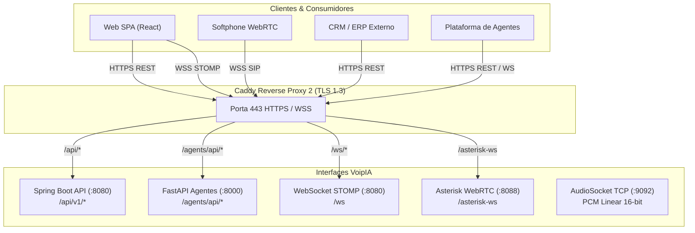

# 📡 Documentação das APIs & WebSockets — VoipIA Enterprise

> **Sistema:** VoipIA — Plataforma Corporativa de Telefonia IP, URA Conversacional com IA, Call Center Omnicanal & Speech Analytics  
> **Versão da API:** v1 / v3.2 Enterprise  
> **Autenticação:** Bearer Token JWT (HMAC-SHA256) / X-Internal-Key  
> **Padrão:** RESTful JSON, WebSocket STOMP, AudioSocket TCP e Asterisk AMI/WSS  
> **Data de Atualização:** Agosto de 2026  

---

## 1. Visão Geral das Interfaces & Protocolos

O **VoipIA** disponibiliza um conjunto completo de interfaces de integração para sistemas corporativos, CRMs, plataformas de BI, canais digitais e agentes de automação:



---

## 2. Autenticação e Padrões de Segurança

### 2.1. Cabeçalho de Autenticação JWT (Bearer Token)
Todas as requisições autenticadas devem incluir o header HTTP `Authorization`:
```http
Authorization: Bearer <seu_token_jwt>
```

### 2.2. Respostas de Erro Padronizadas
As respostas de erro seguem o padrão RFC 7807 (Problem Details):
```json
{
  "timestamp": "2026-08-19T15:30:00Z",
  "status": 401,
  "error": "Unauthorized",
  "message": "Token JWT inválido ou expirado.",
  "path": "/api/v1/calls/history"
}
```

---

## 3. Catálogo Completo de Endpoints REST

### 3.1. Autenticação & Sessão (`/api/v1/auth`)

#### `POST /api/v1/auth/login`
Autentica o usuário com login e senha (ou hash Argon2id) e retorna o token JWT e permissões RBAC.

* **Requisição:**
```bash
curl -X POST https://app.voiphash.com.br/api/v1/auth/login \
  -H "Content-Type: application/json" \
  -d '{
    "username": "operador.telecom",
    "password": "SenhaForte@2026",
    "totpCode": "123456"
  }'
```

* **Resposta de Sucesso (200 OK):**
```json
{
  "token": "eyJhbGciOiJIUzUxMiIsInR5cCI6IkpXVCJ9...",
  "refreshToken": "d8e3b4a2-11c9-4f8a-9821-3982749821a",
  "user": {
    "id": 12,
    "username": "operador.telecom",
    "name": "Carlos Silva",
    "role": "ANALISTA",
    "businessUnits": [1, 3],
    "permissions": ["telecom.view", "callcenter.agent", "insights.view"]
  }
}
```

---

### 3.2. URA & Telefonia (`/api/v1/ura` & `/api/v1/calls`)

#### `GET /api/v1/ura/instances`
Lista todas as instâncias de URA ativas no sistema.

* **Requisição:**
```bash
curl -X GET https://app.voiphash.com.br/api/v1/ura/instances \
  -H "Authorization: Bearer <token>"
```

* **Resposta de Sucesso (200 OK):**
```json
[
  {
    "id": 1,
    "extension": "2000",
    "name": "URA Service Desk TI",
    "aiProvider": "GEMINI",
    "model": "gemini-2.5-flash",
    "welcomeMessage": "Olá! Bem-vindo ao suporte de TI da empresa. Como posso te ajudar hoje?",
    "jiraProjectKey": "TI",
    "jiraIssueType": "Incident",
    "isActive": true
  }
]
```

#### `POST /api/v1/calls/register`
Endpoint interno chamado pelo `voipia-ai-agent` ao término da chamada para registrar o CDR e criar ticket no Jira.

* **Requisição:**
```bash
curl -X POST http://voipia-backend:8080/api/v1/calls/register \
  -H "Content-Type: application/json" \
  -H "X-Internal-Key: <internal_key>" \
  -d '{
    "callId": "ast-1724083200.104",
    "callerNumber": "11987654321",
    "extension": "2000",
    "durationSeconds": 142,
    "transcription": "Cliente relatou lentidão no VPN corporativo...",
    "extractedFields": {
      "solicitante": "Carlos Silva",
      "email": "carlos@empresa.com.br",
      "sistema": "VPN",
      "urgencia": "Alta"
    },
    "jiraIssueKey": "TI-4509",
    "aiCostUsd": 0.0034
  }'
```

#### `GET /api/v1/calls/history`
Consulta histórico de chamadas com paginação e filtros por data, número e status.

* **Requisição:**
```bash
curl -X GET "https://app.voiphash.com.br/api/v1/calls/history?page=0&size=20&startDate=2026-08-01&endDate=2026-08-19" \
  -H "Authorization: Bearer <token>"
```

* **Resposta (200 OK):**
```json
{
  "content": [
    {
      "id": 1045,
      "callId": "ast-1724083200.104",
      "callerNumber": "11987654321",
      "extension": "2000",
      "uraName": "URA Service Desk TI",
      "durationSeconds": 142,
      "status": "COMPLETED",
      "jiraKey": "TI-4509",
      "createdAt": "2026-08-19T14:20:00Z"
    }
  ],
  "totalElements": 1520,
  "totalPages": 76
}
```

---

### 3.3. Call Center Omnicanal (`/api/v1/callcenter`)

#### `GET /api/v1/callcenter/queues`
Retorna a lista de filas de atendimento e métricas em tempo real.

* **Requisição:**
```bash
curl -X GET https://app.voiphash.com.br/api/v1/callcenter/queues \
  -H "Authorization: Bearer <token>"
```

* **Resposta (200 OK):**
```json
[
  {
    "id": 1,
    "name": "Fila N1 - Suporte",
    "strategy": "rrmemory",
    "callsWaiting": 2,
    "activeAgents": 6,
    "serviceLevel20s": 94.5,
    "averageWaitTime": 14
  }
]
```

#### `POST /api/v1/callcenter/spy`
Inicia a escuta silenciosa (*Chanspy*) de uma chamada em andamento para supervisores.

* **Requisição:**
```bash
curl -X POST https://app.voiphash.com.br/api/v1/callcenter/spy \
  -H "Authorization: Bearer <token>" \
  -H "Content-Type: application/json" \
  -d '{
    "supervisorExtension": "9002",
    "targetChannel": "PJSIP/4001-000000a4",
    "whisper": false
  }'
```

---

### 3.4. Speech Analytics & Insights (`/api/v1/insights`)

#### `GET /api/v1/insights/calls`
Lista gravações de voz processadas pela inteligência analítica com filtros de sentimento e risco.

* **Requisição:**
```bash
curl -X GET "https://app.voiphash.com.br/api/v1/insights/calls?sentiment=NEGATIVE&riskAlert=true" \
  -H "Authorization: Bearer <token>"
```

* **Resposta (200 OK):**
```json
[
  {
    "callId": "rec-20260819-0941",
    "agentName": "Beatriz Ramos",
    "callerNumber": "2199887766",
    "durationSeconds": 310,
    "sentiment": "NEGATIVE",
    "npsPredicted": 3,
    "scorecardScore": 62.5,
    "riskKeywords": ["PROCON", "cancelamento", "processo judicial"],
    "audioUrl": "/api/v1/insights/audio/rec-20260819-0941.wav"
  }
]
```

#### `POST /api/v1/insights/upload`
Upload em lote de arquivos de áudio externos para processamento assíncrono de transcrição e auditoria.

* **Requisição:**
```bash
curl -X POST https://app.voiphash.com.br/api/v1/insights/upload \
  -H "Authorization: Bearer <token>" \
  -F "file=@gravacao_externa.wav" \
  -F "scorecardId=2" \
  -F "businessUnitId=1"
```

---

### 3.5. Plataforma de Agentes (`/agents/api/v1`)

#### `GET /agents/api/v1/agents`
Lista os agentes de automação cadastrados na plataforma.

* **Requisição:**
```bash
curl -X GET https://app.voiphash.com.br/agents/api/v1/agents \
  -H "Authorization: Bearer <token>"
```

#### `POST /agents/api/v1/execute`
Dispara a execução imediata de um agente de automação.

* **Requisição:**
```bash
curl -X POST https://app.voiphash.com.br/agents/api/v1/execute \
  -H "Authorization: Bearer <token>" \
  -H "Content-Type: application/json" \
  -d '{
    "agentId": 3,
    "parameters": {
      "targetHost": "192.168.10.50",
      "action": "check_disk_health"
    }
  }'
```

---

## 4. WebSockets & Protocolos em Tempo Real

### 4.1. WebSocket STOMP (Spring Boot)
* **Endpoint de Conexão:** `wss://app.voiphash.com.br/ws`
* **Protocolo:** STOMP sobre WebSocket nativo com fallback SockJS.
* **Tópicos de Subscrição:**
  * `/topic/telecom/dashboard` — Métricas gerais de chamadas e troncos em tempo real.
  * `/topic/callcenter/queue-stats` — Volume de fila, chamadas em espera e tempo médio.
  * `/topic/callcenter/agent-status` — Mudanças de estado de operadores (Disponível, Em Chamada, Pausa).

### 4.2. WebSockets SIP / WebRTC (Asterisk)
* **Endpoint de Conexão:** `wss://app.voiphash.com.br/asterisk-ws`
* **Finalidade:** Sinalização SIP PJSIP para softphones WebRTC no navegador (`JsSIP`).
* **Sub-protocolo:** `sip`

### 4.3. Protocolo AudioSocket (TCP :9092)
Streaming de áudio PCM Linear de ultrabaixa latência entre o Asterisk e o container `voipia-ai-agent`.
* **Formato do Pacote:**
  * Byte 1: Tipo de Mensagem (`0x01` = UUID da chamada, `0x10` = Payload de Áudio PCM, `0x00` = Hangup / Fim de chamada).
  * Bytes 2-3: Tamanho do payload em Big-Endian (16-bit unsigned integer).
  * Bytes seguintes: Dados binários (PCM Linear 16-bit mono 8000Hz ou 16000Hz).
