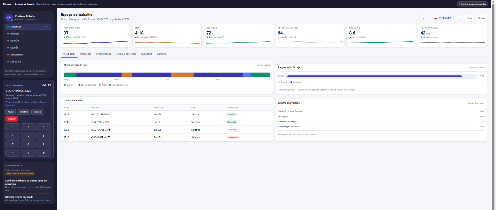
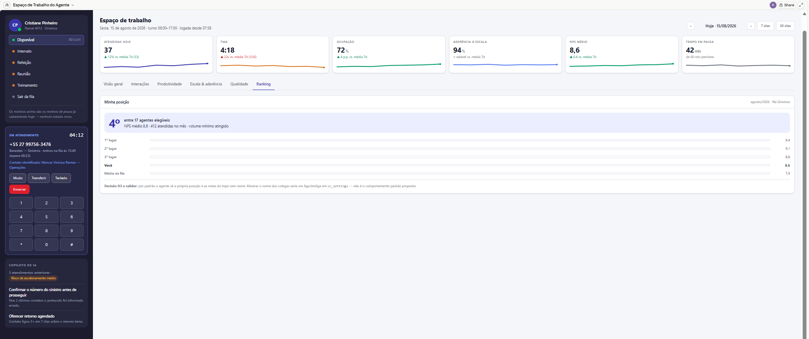
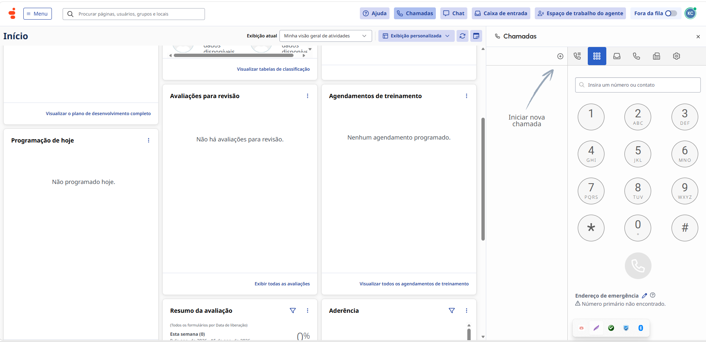
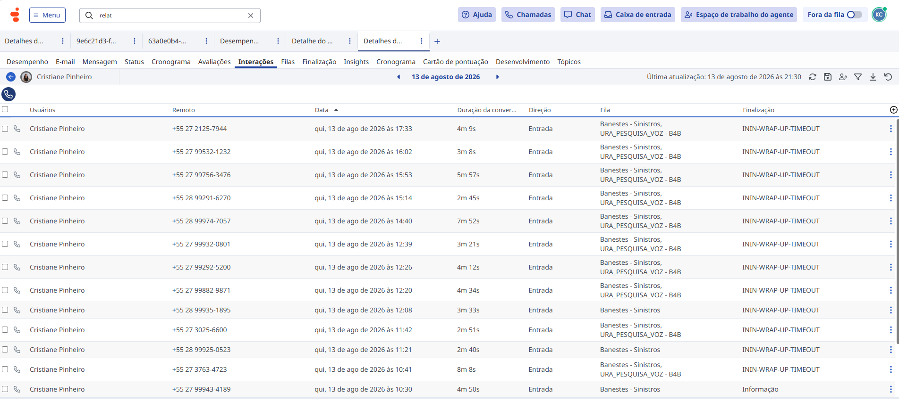
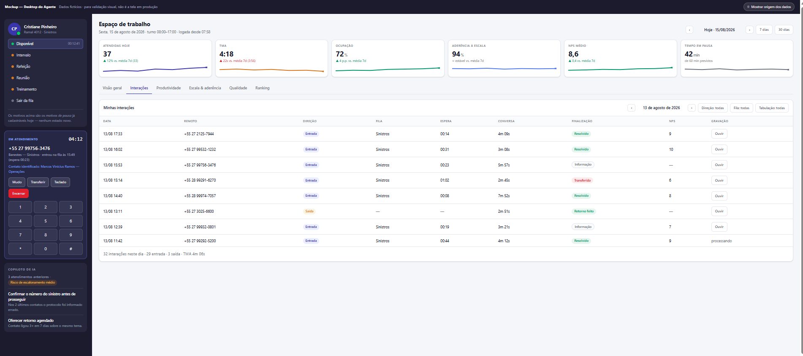
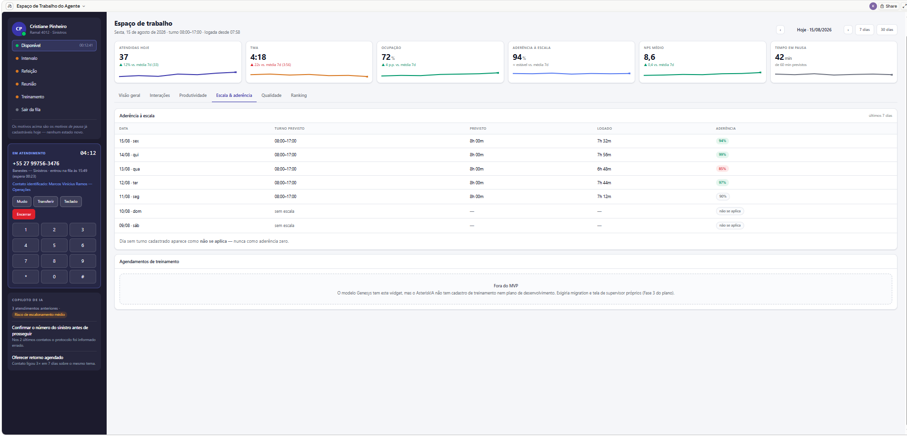
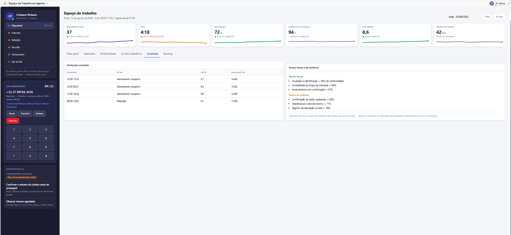
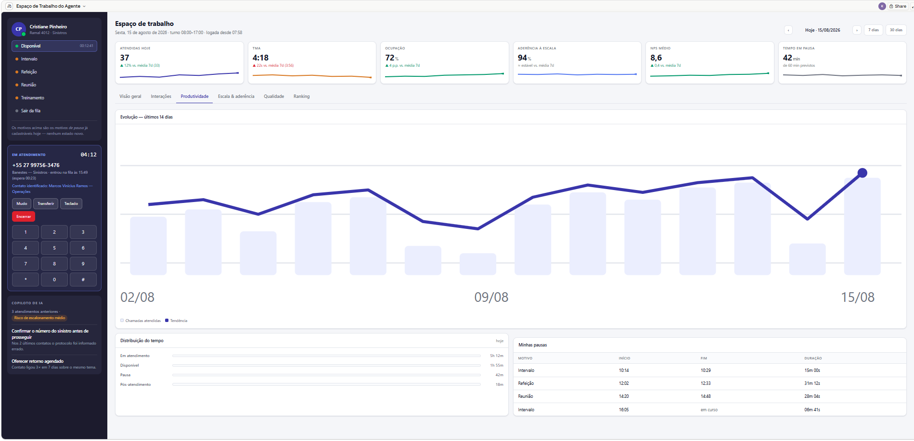

# 📘 Manual do Usuário Completo & Guia Operacional — VoipIA Enterprise

> **Sistema:** VoipIA — Plataforma Corporativa de Telefonia IP, URA Conversacional com IA, Call Center Omnicanal & Speech Analytics  
> **Versão Oficial:** v3.2 Enterprise  
> **Público-Alvo:** Operadores de Atendimento, Agentes de Call Center, Supervisores de Operação, Analistas de Qualidade, Engenheiros de Telecomunicações e Administradores de TI  
> **Endereço de Acesso:** `https://app.voiphash.com.br`  
> **Data de Atualização:** Agosto de 2026  

---

## 📑 Sumário Executivo

1. [Acesso à Plataforma & Segurança de Sessão](#1-acesso-à-plataforma--segurança-de-sessão)
   - 1.1 [Autenticação de Usuário (`/login`)](#11-autenticação-de-usuário-login)
   - 1.2 [Autenticação em Dois Fatores (2FA / TOTP)](#12-autenticação-em-dois-fatores-2fa--totp)
   - 1.3 [Softphone WebRTC Integrado](#13-softphone-webrtc-integrado)
2. [Dashboard Principal — Telecom & Visão Geral](#2-dashboard-principal--telecom--visão-geral)
   - 2.1 [KPIs e Métricas Operacionais em Tempo Real](#21-kpis-e-métricas-operacionais-em-tempo-real)
   - 2.2 [Gráficos de Tendência & Custos](#22-gráficos-de-tendência--custos)
   - 2.3 [Tabela Dinâmica de Chamadas Recentes](#23-tabela-dinâmica-de-chamadas-recentes)
3. [Módulo URA Inteligente com IA de Voz](#3-módulo-ura-inteligente-com-ia-de-voz)
   - 3.1 [Gestão de Instâncias de URA](#31-gestão-de-instâncias-de-ura)
   - 3.2 [Editor de Fluxo de Prompts e Perguntas](#32-editor-de-fluxo-de-prompts-e-perguntas)
   - 3.3 [Integração Nativa com Jira Cloud](#33-integração-nativa-com-jira-cloud)
4. [Módulo Insights — Inteligência Analítica & Speech Analytics](#4-módulo-insights--inteligência-analítica--speech-analytics)
   - 4.1 [Central de Chamadas & Gravações Auditadas](#41-central-de-chamadas--gravações-auditadas)
   - 4.2 [Player de Áudio & Transcrição Diarizada com Sentimento](#42-player-de-áudio--transcrição-diarizada-com-sentimento)
   - 4.3 [Fichas de Monitoria de Qualidade (Scorecards)](#43-fichas-de-monitoria-de-qualidade-scorecards)
   - 4.4 [Gestão de Contestações de Notas de Monitoria](#44-gestão-de-contestações-de-notas-de-monitoria)
   - 4.5 [Planos de Coaching do Atendente & Evolução](#45-planos-de-coaching-do-atendente--evolução)
   - 4.6 [Portal do Supervisor & Upload em Lote de Áudios](#46-portal-do-supervisor--upload-em-lote-de-áudios)
5. [Módulo Financeiro — Gestão e Rateio de Custos de IA](#5-módulo-financeiro--gestão-e-rateio-de-custos-de-ia)
   - 5.1 [Consumo Consolidado de Tokens e Modelos](#51-consumo-consolidado-de-tokens-e-modelos)
   - 5.2 [Rateio por Módulo (URA, Insights e Envios)](#52-rateio-por-módulo-ura-insights-e-envios)
   - 5.3 [Tabela de Tarifas por Modelo de IA](#53-tabela-de-tarifas-por-modelo-de-ia)
6. [Módulo Call Center Omnicanal](#6-módulo-call-center-omnicanal)
   - 6.1 [Desktop do Agente (Espaço do Atendente com Softphone)](#61-desktop-do-agente-espaço-do-atendente-com-softphone)
   - 6.2 [Gestão de Filas de Atendimento & Estratégias](#62-gestão-de-filas-de-atendimento--estratégias)
   - 6.3 [Cadastro de Agentes, Ramais e Habilidades (Skills)](#63-cadastro-de-agentes-ramais-e-habilidades-skills)
   - 6.4 [Painel de Supervisão em Tempo Real (Chanspy & Whisper)](#64-painel-de-supervisão-em-tempo-real-chanspy--whisper)
   - 6.5 [Construtor Visual de Fluxos (Flow Builder)](#65-construtor-visual-de-fluxos-flow-builder)
7. [Plataforma de Agentes de Automação](#7-plataforma-de-agentes-de-automação)
   - 7.1 [Catálogo de Agentes Autônomos (SSH, Web, DB, Logs)](#71-catálogo-de-agentes-autônomos-ssh-web-db-logs)
   - 7.2 [Execuções em Tempo Real e Streaming de Logs](#72-execuções-em-tempo-real-e-streaming-de-logs)
   - 7.3 [Agendador de Tarefas (Scheduler) & Cofre de Segredos](#73-agendador-de-tarefas-scheduler--cofre-de-segredos)
8. [Módulo de Administração & Governança Corporativa](#8-módulo-de-administração--governança-corporativa)
   - 8.1 [Gestão de Usuários e Unidades de Negócio (BU)](#81-gestão-de-usuários-e-unidades-de-negócio-bu)
   - 8.2 [Grupos de Acesso & Matriz de Permissões RBAC Granular](#82-grupos-de-acesso--matriz-de-permissões-rbac-granular)
   - 8.3 [Cadastro Telecom (0800, Troncos E1/DDR, Operadoras)](#83-cadastro-telecom-0800-troncos-e1ddr-operadoras)
   - 8.4 [Trilha de Auditoria LGPD & Logs de Segurança](#84-trilha-de-auditoria-lgpd--logs-de-segurança)
   - 8.5 [Notas de Versão (Release Notes)](#85-notas-de-versão-release-notes)
9. [Guia de Resolução de Problemas (Troubleshooting)](#9-guia-de-resolução-de-problemas-troubleshooting)
10. [Canais de Suporte & Atendimento](#10-canais-de-suporte--atendimento)

---

## 1. Acesso à Plataforma & Segurança de Sessão

### 1.1. Autenticação de Usuário (`/login`)
O acesso ao VoipIA é realizado através do navegador moderno no endereço corporativo `https://app.voiphash.com.br`.

#### Procedimento de Login:
1. Digite seu **Usuário** corporativo.
2. Digite sua **Senha**. Use o ícone do olho (👁️) para validar o que foi digitado caso necessário.
3. Clique em **Entrar**. As credenciais são validadas de forma segura com o algoritmo criptográfico **Argon2id**.

---

### 1.2. Autenticação em Dois Fatores (2FA / TOTP)
Quando configurado para sua conta:
1. Abra o aplicativo autenticador no seu smartphone (**Google Authenticator**, **Microsoft Authenticator** ou compatível).
2. Insira o código de 6 dígitos gerado e confirme o login.
3. Em caso de novo cadastro de 2FA, leia o QR Code exibido na tela antes de digitar o código de confirmação.

---

### 1.3. Softphone WebRTC Integrado
O VoipIA conta com um softphone WebRTC embutido diretamente na interface (canto inferior direito ou no Desktop do Agente).

#### Recursos do Softphone:
* **Indicador de Registro:** Ponto verde com `Registrado (Ramal 9001)` indica que o ramal está pronto para discar e receber ligações.
* **Teclado Numérico & DTMF:** Permite digitar números telefônicos ou enviar dígitos durante a ligação para navegar em URAs externas.
* **Controles Rápidos:**
  * **Mudo (Mute):** Desativa temporariamente o microfone do operador.
  * **Pausa / Retenção (Hold):** Coloca o interlocutor em espera com música de retenção.
  * **Desligar:** Encerra a chamada imediatamente.

---

## 2. Dashboard Principal — Telecom & Visão Geral

O Dashboard consolida a visão operacional de telecomunicações, saúde dos troncos e custos de inteligência artificial em tempo real via **WebSocket STOMP**.

### 2.1. KPIs e Métricas Operacionais em Tempo Real
* **Total de Chamadas URA:** Volume de ligações atendidas pela IA no dia/mês.
* **Chamados Jira Criados:** Quantidade de issues geradas com sucesso a partir das ligações.
* **Tempo Médio de Atendimento (TMA):** Duração média das interações conversacionais.
* **Status do Tronco SIP:** Conexão ativa (`ONLINE`), latência RTT em milissegundos e pacotes transmitidos.
* **Gasto Acumulado de IA:** Valor total em USD consumido em APIs de voz e linguagem.

### 2.2. Gráficos de Tendência & Custos
* Gráfico interativo com curva horária de pico de tráfego.
* Divisão visual de custos entre URA, Insights e Envios Avulsos.

### 2.3. Tabela Dinâmica de Chamadas Recentes
Exibe as últimas ligações com atualização em milissegundos:
* **Telefone de Origem (ANI):** Número chamador completo (sem mascaramento).
* **Unidade de Negócio (BU):** Identificação da área atendida.
* **Ticket Gerado:** Link direto para abertura do chamado no Jira Cloud.
* **Duração & Horário:** Tempo de conversa e carimbo UTC/Local.

---

## 3. Módulo URA Inteligente com IA de Voz

A URA Conversacional do VoipIA substitui menus numéricos rígidos por agentes de inteligência artificial humanizados capazes de dialogar em linguagem natural.

### 3.1. Gestão de Instâncias de URA
* **Ramal de Destino:** Ramal de discagem no Asterisk (ex: `2000`).
* **Nome & Finalidade:** Identificador operacional (ex: *URA Suporte Corporativo N1*).
* **Motor de IA:** Seleção do provedor padrão (**Google Gemini 2.5 Flash**) ou provedores secundários.

### 3.2. Editor de Fluxo de Prompts e Perguntas
* **Mensagem de Boas-Vindas:** Texto inicial falado com voz neural humanizada.
* **Perguntas Obrigatórias:** Lista de campos que a IA deve coletar durante o diálogo (ex: Nome do Usuário, E-mail, Sistema com Problema, Descrição Detalhada).
* **Sensibilidade de Interrupção (VAD):** Ajuste fino de sensibilidade de silêncio para permitir que o cliente interrompa a IA e fale livremente (*barge-in*).

### 3.3. Integração Nativa com Jira Cloud
* **Chave do Projeto:** Ex: `TI` ou `SUPORTE`.
* **Tipo de Chamado:** `Incident`, `Service Request`, `Task`.
* **Mapeamento de Atributos:** A IA preenche os campos do Jira automaticamente a partir das respostas do cliente.

---

## 4. Módulo Insights — Inteligência Analítica & Speech Analytics

O Insights audita 100% das chamadas gravadas na empresa, transcrevendo os diálogos com separação de interlocutores (diarização) e aplicando critérios de conformidade de qualidade.

### 4.1. Central de Chamadas & Gravações Auditadas
Filtros avançados por data, operador, fila, sentimento da chamada (Positivo, Neutro, Negativo) e alertas de risco.

### 4.2. Player de Áudio & Transcrição Diarizada com Sentimento
Ao clicar em uma gravação:
* **Player com Forma de Onda:** Navegação visual pelo áudio com ajuste de velocidade (1x, 1.25x, 1.5x, 2x).
* **Diálogo Diarizado:** Identificação clara entre **[Atendente]** e **[Cliente]** com marcação de sentimentos por trecho.
* **Resumo Executivo & Palavras de Risco:** Resumo estruturado da chamada e tags de atenção (ex: *Ameaça de PROCON*, *Insatisfação*, *Cancelamento*).

### 4.3. Fichas de Monitoria de Qualidade (Scorecards)
* Criação de formulários personalizados de monitoria com pesos por quesito.
* Avaliação automatizada por IA (Zero esforço manual) com pontuação de 0 a 100%.

### 4.4. Gestão de Contestações de Notas de Monitoria
* Operadores e supervisores podem abrir contestações formais sobre avaliações de qualidade.
* Fluxo com justificativa, reanálise pelo auditor e deferimento/indeferimento de nota.

### 4.5. Planos de Coaching do Atendente & Evolução
* Registro de planos de desenvolvimento individual (PDI) vinculados aos pontos de melhoria identificados na auditoria de voz.
* Acompanhamento de metas e evolução das notas ao longo das semanas.

### 4.6. Portal do Supervisor & Upload em Lote de Áudios
* Envio de múltiplos arquivos de áudio externos (WAV/MP3) para processamento em segundo plano pela inteligência analítica.

---

## 5. Módulo Financeiro — Gestão e Rateio de Custos de IA

Permite aos gestores de TI e Telecom monitorar o investimento e consumo em centavos de dólar de todas as requisições de IA.

### 5.1. Consumo Consolidado de Tokens e Modelos
Exibe a quantidade total de tokens de entrada (*Prompt Tokens*), tokens de saída (*Completion Tokens*) e segundos de áudio processados.

### 5.2. Rateio por Módulo
Gráficos de distribuição de custo entre:
* **URA de Voz:** Custos de áudio em tempo real e chamadas atendidas.
* **Insights:** Custos de transcrição assíncrona e preenchimento de scorecards.
* **Envios Avulsos:** Processamento manual de arquivos pelo Portal do Supervisor.

---

## 6. Módulo Call Center Omnicanal

Plataforma completa de atendimento humano integrada ao PBX Asterisk 21 LTS.

### 6.1. Desktop do Agente (Espaço do Atendente com Softphone)
* Painel de atendimento integrado para operadores com Softphone WebRTC, status de presença (Disponível, Pausa Café, Pausa Almoço, Treinamento), tela de tabulação de chamada (*Disposition*) e consulta à Base de Conhecimento (KB).

### 6.2. Gestão de Filas de Atendimento & Estratégias
* Configuração de filas com estratégias: *Ring All*, *Round Robin com Memória (rrmemory)*, *Least Recent*, *Fewest Calls*.
* Definição de tempo limite de espera, música de espera e transbordo para outras filas ou URAs.

### 6.3. Cadastro de Agentes, Ramais e Habilidades (Skills)
* Associação de operadores a ramais fixos e habilidades com pesos (ex: *Inglês Avançado: 10*, *Suporte N2: 8*).

### 6.4. Painel de Supervisão em Tempo Real (Chanspy & Whisper)
* Supervisores visualizam em tempo real todas as chamadas em andamento e podem:
  * **Escutar Chamada (Spy):** Ouvir o atendimento sem que nenhum dos dois interlocutores perceba.
  * **Sussurrar ao Atendente (Whisper):** Falar no ouvido do operador para orientá-lo sem que o cliente ouça.

### 6.5. Construtor Visual de Fluxos (Flow Builder)
* Criação de fluxos de atendimento com nós visuais de decisão, horário de atendimento (*Business Hours*), URA e transbordo.

---

## 7. Plataforma de Agentes de Automação

Ambiente dedicado para orquestração de agentes autônomos de IA que executam tarefas de infraestrutura e rotinas operacionais.

### 7.1. Catálogo de Agentes Autônomos
* **Agentes SSH:** Execução de rotinas de manutenção em servidores Linux remotos.
* **Agentes Web:** Monitoramento e automação de portais web.
* **Agentes de Banco de Dados:** Validações de integridade e consultas de auditoria.
* **Agentes de Logs:** Análise de anomalias em arquivos de log em tempo real.

### 7.2. Execuções em Tempo Real e Streaming de Logs
Acompanhamento via WebSocket do console de execução de cada agente com retorno detalhado de passos.

### 7.3. Agendador de Tarefas (Scheduler) & Cofre de Segredos
* Agendamentos periódicos via expressões Cron ou intervalos de tempo.
* Armazenamento seguro de chaves SSH, senhas e tokens no cofre de segredos criptografado.

---

## 8. Módulo de Administração & Governança Corporativa

### 8.1. Gestão de Usuários e Unidades de Negócio (BU)
* Criação e edição de contas de usuário.
* Vinculação a uma ou mais Unidades de Negócio para controle de escopo multitenant.

### 8.2. Grupos de Acesso & Matriz de Permissões RBAC Granular
* Configuração de perfis de acesso com matriz de mais de 40 recursos granulares:
  * `telecom.*` — Visualização e gestão do módulo Telecom.
  * `callcenter.*` — Permissões de operador, supervisão, filas e gravações.
  * `insights.*` — Acesso a transcrições, scorecards e contestações.
  * `admin.*` — Acesso aos cadastros mestres e auditoria LGPD.

### 8.3. Cadastro Telecom (0800, Troncos E1/DDR, Operadoras)
* Gestão de rotas de entrada de números 0800 e números de regeneração.
* Cadastro de operadoras de telefonia e parâmetros de sinalização SIP.

### 8.4. Trilha de Auditoria LGPD & Logs de Segurança
* Relatório imutável de todas as ações executadas no sistema (quem, quando, qual IP, qual operação).

### 8.5. Notas de Versão (Release Notes)
* Registro histórico de todas as melhorias e correções implementadas em cada versão da plataforma.

---

## 9. Guia de Resolução de Problemas (Troubleshooting)

| Sintoma / Erro | Possível Causa | Ação Recomendada |
|---|---|---|
| Softphone WebRTC em status `Desconectado` | Bloqueio de porta WSS ou STUN/TURN | Verificar se a porta `443` e a faixa `49152-49652/udp` estão liberadas no firewall. |
| URA atende mas fica muda | Falha na porta RTP ou AudioSocket | Verificar se as portas `16000-16500/udp` estão liberadas e se o container `voipia-ai-agent` está em execução. |
| Erro 401 ao navegar | Token JWT expirado | Faça logout e efetue um novo login para renovar a sessão. |
| Jira não cria chamado | Credenciais ou URL do Jira inválidas | Acesse as configurações da URA e valide o e-mail e API Token do Jira Cloud. |

---

## 10. Canais de Suporte & Atendimento

Para dúvidas técnicas, suporte emergencial ou solicitações de melhorias:
* **E-mail de Suporte:** `suporte@voiphash.com.br`
* **Portal de Chamados:** `https://app.voiphash.com.br`
* **Plantão de Telecom & IA:** Equipe de Engenharia e Sustentação VoipIA.
