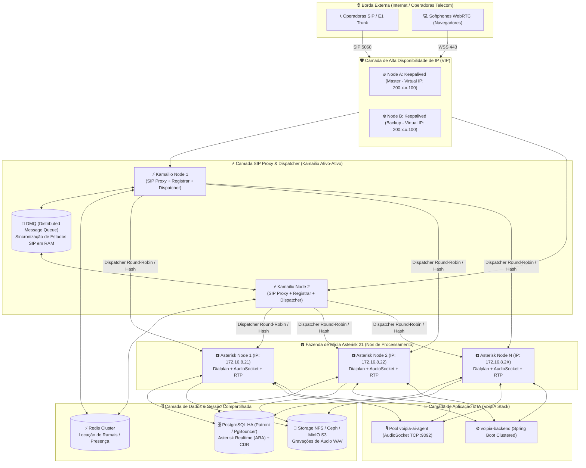

# 📋 Plano de Execução: Clustering de Asterisk em Alta Disponibilidade (HA) Ativo-Ativo via Kamailio

> **Projeto:** VoipIA Enterprise  
> **Status:** Arquivado para Execução Futura (Janela de Escalabilidade v4.0)  
> **Classificação:** Arquitetura de Telecomunicações / Alta Disponibilidade (SLA 99.999% / Carrier-Grade)  
> **Data de Elaboração:** Agosto de 2026  

---

## 1. Visão Geral e Objetivos do Cluster HA

O objetivo deste projeto é eliminar qualquer ponto único de falha (*Single Point of Failure - SPOF*) na camada de telefonia SIP, permitindo:
1. **Escalabilidade Horizontal de Chamadas:** Distribuição transparente de tráfego SIP (de 500 para 5.000+ chamadas simultâneas).
2. **Alta Disponibilidade Ativo-Ativo (*Zero-Downtime Failover*):** Se um nó do Asterisk falhar ou for reiniciado para manutenção, chamadas existentes em outros nós permanecem intactas e novas chamadas são roteadas instantaneamente para os nós saudáveis.
3. **Balanceamento Inteligente com Health Checks:** Verificação em tempo real via SIP `OPTIONS` e telemetria de carga de CPU/canais.

---

## 2. Topologia Arquitetural Carrier-Grade



---

## 3. Especificação Técnica dos Módulos

### 3.1. Kamailio SIP Engine (`kamailio.cfg`)
* **Módulo `dispatcher.so`:** Gerencia a lista de nós Asterisk, enviando pacotes `OPTIONS` a cada 2 segundos. Se um Asterisk não responder em 1 segundo, é marcado como inativo (*probing*) e retirado do pool de tráfego sem derrubar chamadas de outros nós.
* **Módulo `dmq.so` (Distributed Message Queue):** Mantém a tabela de usuários registrados sincronizada entre os nós Kamailio em milissegundos sem sobrecarregar o banco de dados.
* **Módulo `rtpengine.so`:** Atua como proxy de mídia RTP de ultra-alta performance diretamente no espaço de kernel Linux quando necessário transcodificar WebRTC SRTP $\leftrightarrow$ RTP de operadora.

### 3.2. Asterisk Realtime Architecture (ARA)
* Todos os nós de Asterisk operam de forma *stateless* (sem arquivos de configuração estáticos de ramais e filas).
* Tabelas no PostgreSQL: `ps_endpoints`, `ps_auths`, `ps_aors`, `queues`, `queue_members`.
* Quando um operador entra em uma fila ou altera seu status de pausa, a mudança é refletida instantaneamente para todos os nós do cluster via banco de dados e notificação AMI.

### 3.3. Armazenamento Compartilhado de Mídia
* Gravações de chamadas e áudios da URA armazenados em volume de rede compartilhado (NFSv4 ou bucket S3 MinIO com mount fuse).

---

## 4. Arquivos de Configuração de Referência

### 4.1. `dispatcher.list` (Kamailio)
```ini
# SETID(int) DESTINATION(sip:host:port) FLAGS(int) PRIORITY(int) ATTRS(str)
# Set 1: Asterisk Media Farm
1 sip:172.16.8.21:5060 0 10 maxload=150;weight=50
1 sip:172.16.8.22:5060 0 10 maxload=150;weight=50
1 sip:172.16.8.23:5060 0 10 maxload=150;weight=50
```

### 4.2. Trecho de Roteamento no `kamailio.cfg`
```c
route[DISPATCH_ASTERISK] {
    # Algoritmo 4 = Round-Robin com checagem de carga e failover
    if (!ds_select_dst(1, 4)) {
        send_reply(503, "Nenhum Servidor de Midia Asterisk Disponivel");
        exit;
    }
    
    t_on_failure("DISPATCH_FAILOVER");
    route(RELAY);
}

failure_route[DISPATCH_FAILOVER] {
    if (t_is_canceled()) {
        exit;
    }
    # Em caso de falha 500/503 do nó escolhido, tenta o próximo nó ativo
    if (t_check_status("500|503|408")) {
        if (ds_next_dst()) {
            t_on_failure("DISPATCH_FAILOVER");
            route(RELAY);
            return;
        }
    }
}
```

---

## 5. Roteiro Passo a Passo para Implantação Futura

### Etapa 1: Preparação de Infraestrutura (2 Dias)
1. Provisionar 2 instâncias para Kamailio Borda (2 vCPU, 4GB RAM) e 2+ instâncias para nós Asterisk (4 vCPU, 8GB RAM).
2. Configurar Keepalived com Virtual IP compartilhado na borda.
3. Provisionar volume NFS ou bucket MinIO para `/opt/VoipIA/media/recordings`.

### Etapa 2: Configuração do Banco de Dados Realtime (1 Dia)
1. Habilitar conexões `res_config_pgsql` em todos os nós Asterisk apontando para o cluster PostgreSQL.
2. Validar que cadastros de ramais via Web UI são lidos instantaneamente pelos nós Asterisk 1 e 2.

### Etapa 3: Homologação e Testes de Carga (2 Dias)
1. **Teste de Sobrevivência (*Chaos Engineering*):** Desligar abruptamente o `Asterisk Node 1` durante chamadas em andamento e validar se novas chamadas entram em menos de 100ms no `Asterisk Node 2`.
2. **Teste de Estresse com SIPp:** Injetar 1.000 chamadas simultâneas para validar distribuição homogênea de tráfego e latência do AudioSocket.

---

## 6. Critérios de Aceite & Validação Final

- [ ] Zero perda de chamadas novas durante a reinicialização planejada de qualquer nó Asterisk.
- [ ] Tempo de detecção de falha de nó $\le 1.5$ segundos.
- [ ] Sincronização em tempo real de filas do Call Center e agentes em todos os nós.
- [ ] Gravações consolidadas e indexadas sem fragmentação.
