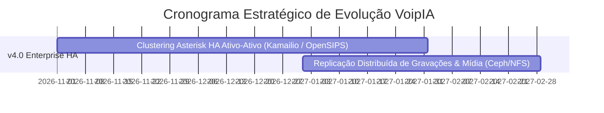

# 🗺️ Roadmap de Evolução do Produto — VoipIA Enterprise

> **Sistema:** VoipIA — Plataforma Corporativa de Telefonia IP, URA Conversacional com IA, Call Center Omnicanal & Speech Analytics  
> **Versão Atual:** v3.5 Enterprise  
> **Data de Atualização:** Agosto de 2026  

---

## 1. Visão Estratégica do Produto

O **VoipIA** é posicionado como a plataforma corporativa de telecomunicações e inteligência de voz para empresas que buscam autonomia, alta disponibilidade, custos previsíveis e inovação acelerada com inteligência artificial generativa de ponta.

---

## 2. Histórico de Versões e Marcos Concluídos

### 🏁 Versão 1.0 (MVP — Fundação) — Concluída
* PBX Asterisk 21 LTS rodando em container Docker com `chan_pjsip`.
* Agente de IA em Python 3.12 com suporte a streaming de áudio via AudioSocket TCP.
* URA Inteligente com integração para abertura de chamados no Jira Cloud.

### 🏁 Versão 2.0 (Call Center & Softphone WebRTC) — Concluída
* Implementação do Desktop do Agente com Softphone WebRTC (`JsSIP`) embutido no navegador.
* Distribuição de chamadas com filas (*Queues*), ramais e controle de presença.
* Painel de supervisão com escuta silenciosa (*Chanspy*) e sussurro (*Whisper*).
* Servidor Coturn integrado para NAT Traversal em redes corporativas restritas.

### 🏁 Versão 3.0 (Speech Analytics & Inteligência de Voz) — Concluída
* Módulo **Insights** para auditoria de 100% das chamadas com separação de falantes (diarização).
* Fichas de monitoria de qualidade (Scorecards) preenchidas automaticamente por IA.
* Módulo Financeiro com telemetria detalhada de consumo de tokens e custos em USD.

### 🏁 Versão 3.2 (Omnichannel, Gestão de QM, Flow Builder & pgvector) — Concluída
* Construtor visual de fluxos de atendimento (*Flow Builder*).
* Chat Omnichannel (Telegram e Web Widget) e Co-Browsing com consentimento.
* Gestão completa de contestações de monitorias e planos de coaching (PDI) para atendentes.
* Base vetorial nativa no PostgreSQL 16 com extensão **pgvector** para base de conhecimento RAG.
* Matriz de permissões RBAC granular com mais de 40 recursos e suporte multitenant por BU.
* Hardening de segurança OWASP ASVS Nível 2 e proxy Caddy com terminação TLS 1.3.

### 🏁 Versão 3.5 (Evoluções Corporativas, WFM, pgvector & Copiloto) — Concluída
* **Digital Twin & WFM Preditivo (Erlang-C):** Cálculo em tempo real de intensidade de tráfego, probabilidade de espera $P_w$, SLA previsto e dimensionamento preditivo de agentes por fila.
* **Busca Semântica Completa de Gravações (pgvector):** Consultas vetoriais nativas por similaridade de cosseno com índice HNSW sobre o acervo histórico de chamadas.
* **SSO Corporativo via Microsoft Entra ID (OIDC):** Autenticação unificada com suporte a OpenID Connect, auto-provisionamento de ramais SIP WebRTC e gestão centralizada.
* **Copiloto Realtime no Desktop do Agente:** Assistente de IA que entrega artigos de apoio e respostas sugeridas via WebSocket STOMP em tempo real.
* **Consolidação do Menu "Sistema & Governança":** Agrupamento administrativo de Configurações, SSO, RBAC e Trilha de Auditoria.

---

## 3. Próximo Marco Estratégico (H2 2026 / 2027)

### 🚀 Versão 4.0 (Clustering Asterisk HA Ativo-Ativo)
* **Plano Arquitetural Já Estruturado:** Detalhado em [`docs/PLANO_CLUSTERING_ASTERISK_HA.md`](PLANO_CLUSTERING_ASTERISK_HA.md).
* **Topologia:** Balanceamento de múltiplos nós Asterisk via Kamailio / OpenSIPS com Keepalived VIP (VRRP), DMQ para sincronização de sessões em memória e banco ARA unificado.
* **Armazenamento de Mídia em HA:** Armazenamento compartilhado de gravações via NFSv4/CephFS.
