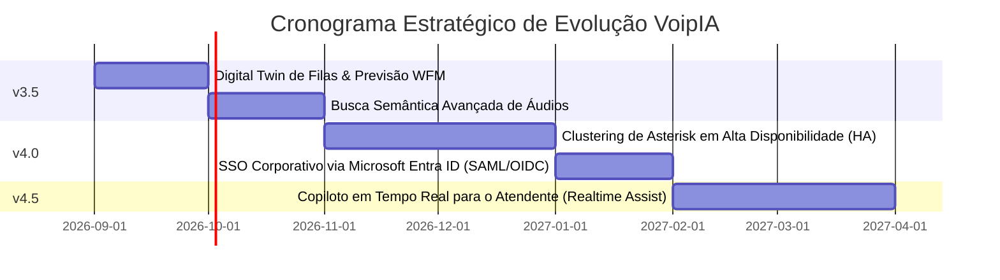

# 🗺️ Roadmap de Evolução do Produto — VoipIA Enterprise

> **Sistema:** VoipIA — Plataforma Corporativa de Telefonia IP, URA Conversacional com IA, Call Center Omnicanal & Speech Analytics  
> **Versão Atual:** v3.2 Enterprise  
> **Data de Atualização:** Agosto de 2026  

---

## 1. Visão Estratégica do Produto

O **VoipIA** é posicionado como a plataforma definitiva de telecomunicações e inteligência de voz para empresas que buscam autonomia, alta disponibilidade, custos previsíveis e inovação acelerada com inteligência artificial generativa de ponta.

---

## 2. Histórico de Versões e Marcos Concluídos

### 🏁 Versão 1.0 (MVP — Fundação) — Concluída
* PBX Asterisk 21 LTS rodando em container Docker com `chan_pjsip`.
* Agente de IA em Python 3.12 com suporte a streaming de áudio via AudioSocket TCP.
* URA Inteligente com integração para abertura de chamados no Jira Cloud.
* Testador automático de rotas e números de telefonia (Módulo 2).
* Alertas de infraestrutura com disparo de chamadas telefônicas via Zabbix (Módulo 3).

### 🏁 Versão 2.0 (Call Center & Softphone WebRTC) — Concluída
* Implementação do Desktop do Agente com Softphone WebRTC (`JsSIP`) embutido no navegador.
* Distribuição de chamadas com filas (*Queues*), ramais e controle de presença.
* Painel de supervisão com escuta silenciosa (*Chanspy*) e sussurro (*Whisper*).
* Servidor Coturn integrado para NAT Traversal em redes corporativas restritas.

### 🏁 Versão 3.0 (Speech Analytics & Plataforma de Agentes) — Concluída
* Módulo **Insights** para auditoria de 100% das chamadas com separação de falantes (diarização).
* Fichas de monitoria de qualidade (Scorecards) preenchidas automaticamente por IA.
* Plataforma de Agentes de Automação em FastAPI com tarefas SSH, Web, DB e Logs.
* Módulo Financeiro com telemetria detalhada de consumo de tokens e custos em USD.

### 🏁 Versão 3.2 (Omnichannel, Gestão de QM & pgvector) — Concluída
* Gestão completa de contestações de monitorias e planos de coaching (PDI) para atendentes.
* Base vetorial nativa no PostgreSQL 16 com extensão **pgvector** para base de conhecimento.
* Matriz de permissões RBAC granular com mais de 40 recursos e suporte multitenant por BU.
* Hardening de segurança OWASP ASVS Nível 2 e proxy Caddy com terminação TLS 1.3.

---

## 3. Próximos Marcos de Evolução (H2 2026 / 2027)

### 🚀 Versão 3.5 (Previsão: Outubro de 2026)
* **Digital Twin & Previsão Preditiva de Filas:** Algoritmos matemáticos de fila para antecipar estouros de SLA e alertar supervisores com 15 minutos de antecedência.
* **Busca Semântica Completa de Gravações:** Pesquisa livre por intenção e conceitos em toda a base histórica de chamadas usando vetores do pgvector.

### 🚀 Versão 4.0 (Previsão: Janeiro de 2027)
* **Clustering Asterisk HA Ativo-Ativo:** Suporte a múltiplos nós de Asterisk com balanceamento de carga SIP via Kamailio / OpenSIPS.
* **SSO Corporativo Microsoft Entra ID:** Autenticação unificada com Single Sign-On corporativo (OIDC + PKCE).

### 🚀 Versão 4.5 (Previsão: Abril de 2027)
* **Copiloto Realtime no Desktop do Agente:** Assistente de IA que escuta a chamada em tempo real e sugere artigos da base de conhecimento e respostas na tela do operador durante o atendimento.
