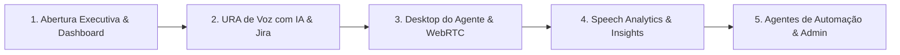

# 🎬 Roteiro Master de Treinamento, Apresentação & Demonstração — VoipIA Enterprise

> **Sistema:** VoipIA — Plataforma Corporativa de Telefonia IP, URA Conversacional com IA, Call Center Omnicanal & Speech Analytics  
> **Versão Oficial:** v3.2 Enterprise  
> **Público-Alvo:** Gestores Executivos, Supervisores de Atendimento, Operadores de Call Center e Administradores de TI  
> **Duração Estimada:** 15 a 30 minutos (Apresentação Completa)  
> **Data de Atualização:** Agosto de 2026  

---

## 1. Visão Geral da Demonstração

Este roteiro fornece o passo a passo estruturado para conduzir apresentações executivas, treinamentos operacionais e gravações de vídeos demonstrativos do ecossistema **VoipIA**.

---

## 2. Roteiro de Demonstração Executiva (10 Minutos)

### Bloco 1: Abertura & Visão Geral da Plataforma (2 minutos)
1. **Apresentar o Contexto:** Explicar que o VoipIA unifica telefonia corporativa de ponta com inteligência artificial generativa em tempo real.
2. **Exibir o Dashboard Principal (`https://app.voiphash.com.br`):**
   * Mostrar os KPIs em tempo real: Total de Chamadas da URA, chamados gerados no Jira, status do tronco SIP e consumo financeiro em dólares (USD).
   * Destacar a atualização em milissegundos via WebSockets sem necessidade de recarregar a página.

### Bloco 2: Demonstração Prática da URA Conversacional de IA (3 minutos)
1. **Realizar uma Chamada ao Vivo:**
   * Utilizar o Softphone WebRTC da tela e discar para o ramal `2000` (ou ligar para o número 0800 corporativo).
   * Demonstrar o diálogo em linguagem natural com o **Google Gemini 2.5 Flash**.
   * Simular uma solicitação de suporte: "*Olá, meu nome é Carlos Silva, meu e-mail é carlos@empresa.com.br e estou com problema de lentidão no acesso à VPN corporativa*".
2. **Mostrar o Resultado Imediato:**
   * Desligar a ligação.
   * Mostrar o registro de bilhetagem (CDR) aparecendo no Dashboard.
   * Clicar no link do chamado do Jira gerado automaticamente com todos os dados preenchidos pela IA.

### Bloco 3: Call Center, Softphone WebRTC & Supervisão (2 minutos)
1. **Acessar o Desktop do Agente (`/callcenter`):**
   * Demonstrar o softphone integrado atendendo uma chamada de fila.
   * Mostrar os botões de controle: Mudo, Retenção (Hold) e Tabulação de Chamada (*Disposition*).
2. **Painel de Supervisão:**
   * Mostrar a visão do supervisor acompanhando chamadas simultâneas.
   * Explicar as funções de **Escuta Silenciosa (Spy)** e **Sussurro (Whisper)**.

### Bloco 4: Speech Analytics, Qualidade & IA (2 minutos)
1. **Acessar o Módulo Insights (`/insights`):**
   * Abrir uma chamada auditada com transcrição diarizada entre Atendente e Cliente.
   * Demonstrar a forma de onda do áudio interativo, a marcação de sentimentos e o alerta de palavras de risco.
   * Mostrar o Scorecard de qualidade preenchido 100% pela IA com nota calculada e justificativa.

### Bloco 5: Governança, Custos & Fechamento (1 minuto)
1. **Módulo Financeiro:** Demonstrar o controle granular de centavos de dólar consumidos por chamada.
2. **Segurança:** Destacar a autenticação com Argon2id, 2FA e conformidade com LGPD (trilha de auditoria).

---

## 3. Roteiro de Treinamento Técnico para Administradores de TI & Telecom

### Módulo T-01: Arquitetura de Containers & Portas
* Entendimento da rede bridge Docker `172.16.8.0/24`.
* Papel do proxy Caddy 2 com TLS 1.3 automático e certificados Let's Encrypt.
* Isolamento do banco de dados PostgreSQL 16 na porta `127.0.0.1:5432`.
* Liberação de portas no firewall UFW / Firewalld: SIP (`5060`), RTP (`16000-16500/udp`) e Coturn (`3478` / `49152-49652/udp`).

### Módulo T-02: Gestão de Troncos SIP & Cadastro de Linhas
* Cadastro de operadoras de telefonia e IPs de sinalização.
* Parametrização de ramais WebRTC na faixa `9000` e ramais SIP físicos.
* Configuração de rotas de entrada e saída no Asterisk 21 LTS.

### Módulo T-03: Parametrização da URA & Prompts de IA
* Criação de novas instâncias de URA no ramal desejado.
* Configuração do Prompt do Sistema e definição das perguntas estruturadas.
* Ajuste de sensibilidade de silêncio (VAD) para adequação a diferentes tipos de linha.

### Módulo T-04: Gestão de Usuários e Matriz RBAC
* Cadastro de novos operadores e supervisores.
* Vinculação a Unidades de Negócio (BUs) para escopo multitenant.
* Atribuição de permissões granulares por grupo de acesso.

---

## 4. Roteiro de Treinamento Operacional para Atendentes e Supervisores

### Módulo O-01: Operação do Desktop do Agente
1. **Login e Presença:** Como iniciar a jornada de trabalho, logar no sistema e alterar o estado para `Disponível`.
2. **Uso das Pausas:** Seleção de motivos de pausa homologados (Café, Almoço, Feedback, Treinamento).
3. **Atendimento de Chamadas:** Como receber e discar pelo softphone WebRTC no navegador.
4. **Finalização e Tabulação:** Preenchimento obrigatório da tabulação ao término da ligação.

### Módulo O-02: Acompanhamento de Qualidade & Contestações
1. **Consulta às Avaliações:** Como o operador consulta seus scorecards e notas de monitoria.
2. **Abertura de Contestação:** Como abrir um recurso caso discorde da avaliação feita pela IA ou supervisor.
3. **Plano de Coaching (PDI):** Visualização das metas e orientações de desenvolvimento individual.
