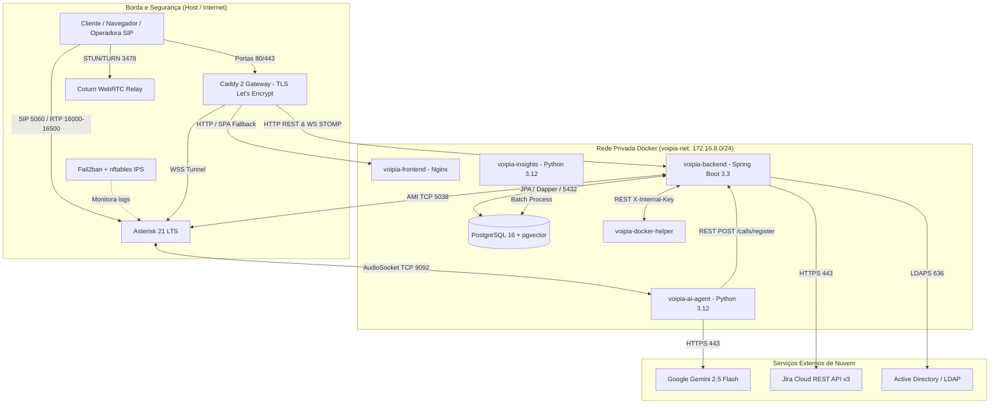
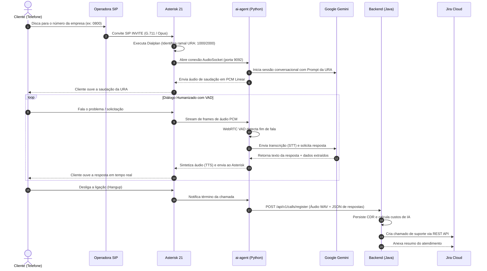

# Arquitetura de Software & Infraestrutura — VoipIA

> **Versão da Arquitetura:** v3.2 Enterprise  
> **Classificação:** Arquitetura de Sistemas / Engenharia de Software / DevSecOps

---

## 1. Visão Geral da Arquitetura

O **VoipIA** é uma plataforma corporativa modular de alta disponibilidade (HA) para telefonia IP, URA conversacional inteligente, Call Center omnicanal e inteligência de voz. A arquitetura foi concebida para suportar centenas de chamadas simultâneas com baixa latência de processamento de áudio, alta resiliência a falhas e isolamento por container Docker.

---

## 2. Fluxos Principais de Dados

### 2.1 Fluxo de Atendimento da URA Conversacional (Tempo Real)

---

## 3. Regras Críticas de Negócio

### 3.1 Política de Não-Mascaramento de CDR (CDR Privacy Compliance)
- Por diretriz expressa de auditoria e conformidade técnica do ecossistema, os números de telefone completos (ANI e B-Number) **nunca são mascarados** no banco de dados, relatórios ou interfaces para usuários autorizados.

### 3.2 Isolamento Multitenant por Unidade de Negócio (BU Scoping)
- Cada usuário operador ou supervisor pertence a uma ou mais **Unidades de Negócio (BU)** vinculadas no cadastro (`user_business_units`).
- As consultas ao histórico de chamadas, transcrições e cadastros filtram obrigatoriamente por `BU_ID`.
- Usuários com perfil `ADMIN` possuem visão global de todas as BUs.

### 3.3 Matriz de Segurança RBAC Granular
- A autorização não se limita ao binário ADMIN/USER; utiliza-se uma matriz de permissões por chave de recurso (`resource_key`), por exemplo:
  - `telecom.settings`: Leitura (`r`) ou Leitura/Escrita (`rw`).
  - `insights.reports`: Permite extração de relatórios.
  - `callcenter.supervisao`: Habilita escuta (Spy) e whisper no Call Center.

---

## 4. Segurança & DevSecOps (OWASP Top 10 & Zero Trust)

1. **Proteção Criptográfica:**
   - Senhas locais armazenadas utilizando **Argon2id** (configuração com memória e iterações resistentes a ataques paralelos de GPU).
   - Tokens JWT assinados com chave HMAC-SHA256 de 512 bits.
2. **Isolamento de Credenciais (Zero Secrets in Code):**
   - Nenhuma senha, chave de API ou segredo de banco é versionado no Git. Todas as credenciais são carregadas via arquivo de ambiente estritamente protegido (`/opt/VoipIA/env/.env`, com permissão `chmod 600`).
3. **Prevenção de Ataques de Força Bruta (SIP & Web):**
   - **Camada Web:** Filtro `RateLimitFilter` bloqueia requisições excessivas por IP com lista de proxies confiáveis.
   - **Camada SIP:** `Fail2ban` monitora as tentativas de registro inválidas no Asterisk e aplica regras imediatas no firewall `nftables` do kernel Linux.

---

## 5. Resiliência, Alta Disponibilidade & Degradação Graciosa

- **Degradação da IA:** Se a conexão com a API do Google Gemini sofrer timeout ou instabilidade (503):
  1. A URA não derruba a chamada.
  2. Executa mensagem pré-gravada de contingência ("*Nosso sistema inteligente está processando sua solicitação, aguarde enquanto transferimos para um atendente*").
  3. Transfere a chamada automaticamente para a fila humana do Call Center.
- **Healthchecks Ativos:** Todos os containers possuem sondas de integridade periódicas configuradas no Docker Compose.
- **Isolamento de Falhas:** O travamento do container de relatórios (Insights) ou de Agentes não afeta a recepção de chamadas no Asterisk nem a API principal de telefonia.
